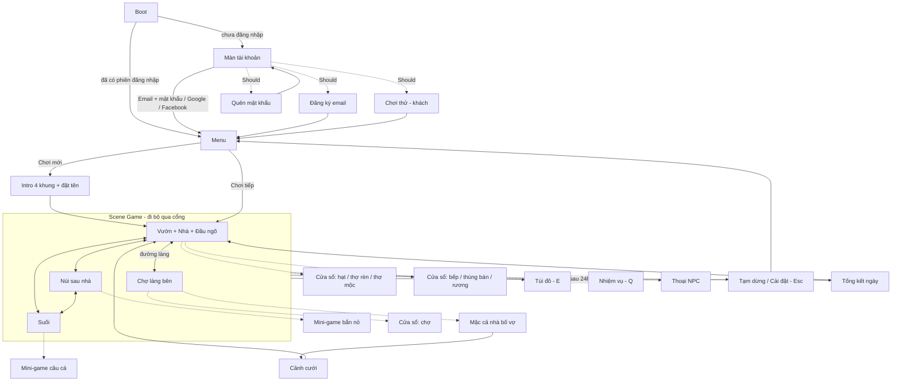

# Game Design Document — Bride Price Hustle

> Phụ đề tiếng Việt: *Làng Lầy Cưới Vợ*
>
> Chủ sở hữu: `game-planner` · Phiên bản: v0.9 (concept B, bản web trình duyệt PC — xem D-004 … D-017) · Tiến độ: xem [journey.md](../journey.md)

## 1. Tổng quan

| Mục | Nội dung |
|---|---|
| Tên game | **Bride Price Hustle** (tên hiển thị + tên project). Phụ đề / tên tiếng Việt: *Làng Lầy Cưới Vợ*. Thư mục repo vẫn tên `chibi` (Giả định: không đổi tên thư mục để tránh hỏng đường dẫn). |
| Logline (1 câu) | Từ mảnh vườn còi cọc, anh nông dân nghèo mở dần núi, suối, chợ làng bên, qua mùa nắng mùa mưa, lên đủ "tiếng tăm" để được mặc cả sính lễ với ông bố vợ khó tính nhất vùng. |
| Thể loại | Nông trại nhẹ (farming sim thu nhỏ) + mini-game, hài hước. Mini-game = trò chơi nhỏ lồng trong game chính. |
| Nền tảng | **Web game chạy trên trình duyệt máy tính** (D-011): Chrome, Edge, Firefox bản mới trên Windows/macOS. Màn ngang 16:9, chơi bằng **bàn phím + chuột** (WASD đi lại, chuột làm việc). Người chơi có **tài khoản** (email/mật khẩu, Google hoặc Facebook), save lưu trên server (cloud save), chơi máy nào cũng tiếp được. Phát hành ở tên miền riêng (Giả định), có thể đăng thêm lên itch.io dạng HTML5. Web trên điện thoại: để sau. |
| Người chơi mục tiêu | Người Việt 16–40 tuổi, thích game nhẹ nhàng và câu đùa kiểu làng quê; chơi trên máy tính buổi tối hoặc cuối tuần, quen kiểu game nông trại như Stardew Valley |
| Độ dài phiên chơi | 1 ngày trong game = **10 phút thời gian thật** (6h sáng → 24h). Trên PC, một lần ngồi chơi thường 20–60 phút (2–6 ngày game). Game **tự lưu thường xuyên** lên server (mỗi lần đổi khu, mỗi 30 giây, khi đóng tab) và **tự tạm dừng** khi tab mất focus (chuyển tab, Alt+Tab, thu nhỏ trình duyệt). Thoát giữa ngày, quay lại vẫn đúng giờ, đúng chỗ đó. |
| Điểm khác biệt (USP) | **Màn mặc cả sính lễ** và thoại "lầy" kiểu làng quê Việt (thợ mộc chê khó để đòi thêm tiền, bố vợ im lặng nhấp trà); làng quê Việt (lũy tre, ruộng lúa, chợ quê) hiếm thấy trong game nông trại |
| Game tham khảo | *Stardew Valley*: vòng trồng → bán → nâng cấp, WASD + chuột, bản đồ nhiều khu nối nhau. *Ridiculous Fishing / Stardew* (câu cá): giữ chuột để kéo, đã tay. *Papers, Please / Recettear*: mặc cả và phản ứng NPC làm thành trò chơi. |

### Design pillars

Pillar = trụ cột cảm giác của game. Tính năng nào không phục vụ ít nhất 1 pillar thì vào "Để sau".

1. **Mặc cả lầy lội** — Nói chuyện với NPC nào (thợ mộc, thợ rèn, bố vợ) cũng là một màn hài, và tiền bạc luôn là chuyện "tế nhị".
2. **Mỗi khu một trò** — Vườn, núi, suối, chợ: mỗi khu có một kiểu chơi riêng, dễ hiểu ngay, mỗi lượt chỉ vài chục giây.
3. **Làm giàu từ hai bàn tay** — Mỗi nâng cấp thấy rõ thay đổi (thêm ruộng, công cụ tốt hơn, bếp đẹp hơn), tiến dần tới đám cưới.

## 2. Vòng chơi

- **Core loop (≤ 30s):** Core loop = vòng hành động lặp lại liên tục.
  Đi tới bằng WASD, click ô hoặc vật thể cạnh nhân vật (đất, bụi cây, mặt nước, con gà) → nhân vật làm việc kèm tiếng "bộp", hạt bụi, màn hình nảy nhẹ → nhận đồ hoặc tiền bay lên, thanh Sức giảm một chút.
- **Vòng một ngày (10 phút thật):** 6h sáng thức dậy (thanh Sức đầy) → buổi sáng chăm vườn → buổi trưa/chiều đi núi, suối, chợ kiếm đồ → ăn để hồi Sức khi đuối → tối về nhà; click giường để ngủ (quá 24h chưa ngủ thì ngủ gục tại chỗ, §3.1) → **cuối ngày bán đồ trong thùng bán** (chợ làng bên bán ngay, giá cao hơn — §3.9) → màn tổng kết ngày: tiền và tiếng tăm nhận được.
  - Nhịp gợi ý: 1 ngày ≈ 3–4 "chuyến" (mỗi chuyến 2–3 phút ở một khu, tính cả đi bộ qua đường mòn).
- **Meta loop (lý do chơi lại):** Meta loop = mục tiêu dài hạn khiến người chơi quay lại.
  Kiếm tiền → nâng cấp hoặc chế đồ → làm **nhiệm vụ** → lên **level** → mở khu mới → … → level 10 mở nhiệm vụ cưới vợ → mặc cả sính lễ → cưới → chơi tiếp mãi (endless): nuôi gia đình (con cái, gia súc, tiền cơm hằng ngày), mục tiêu tài sản và level cao hơn. Bản 1.1: cưới thêm vợ 2–3.
  Song song: **sắm sửa để lên bậc ngoại hình** (D-015, §3.14) — Nghèo kiết xác → Người bình thường → Khá giả → Phú ông. Nhìn nhân vật là thấy mình đã giàu tới đâu.

### Hệ level (tóm tắt — bảng XP và nhiệm vụ chi tiết ở §7)

- **Tiếng tăm** (`reputationXp`) là điểm kinh nghiệm. Có được từ thu hoạch, bán hàng, câu cá, săn, và nhiều nhất là từ **nhiệm vụ**.
- Đủ tiếng tăm thì lên level. Mỗi level mở một thứ mới để người chơi luôn có cái để mong:

| Level | Mở khóa (dự kiến) | Nhiệm vụ gợi ý |
|---|---|---|
| 1 | Vườn 3×3 ô, rau cải + khoai lang + rau muống; **Đầu ngõ** (hàng hạt, thợ rèn, thợ mộc) | Ruộng đầu tay |
| 2 | **Núi sau nhà**: hái nấm, măng, sim, chặt củi, tre | Rào vườn (mua thêm 3 ô) |
| 3 | Dưa hấu; thợ rèn làm cuốc sắt; **sắm "Bộ đồ lành"** ở quán chị Thóc (bậc 2 — §3.14) | Cuốc mới, sức mới |
| 4 | **Suối**: câu cá (chế cần câu ở thợ mộc); rìu sắt | Cần câu tre |
| 5 | Lúa nếp (mùa mưa), ủ rượu nếp; thùng tưới | Nếp mùa mưa |
| 6 | **Chợ làng bên**: bán giá ×1.3, mua lễ vật, nhà bố vợ | Đơn hàng chợ |
| 7 | Gùi to, cần câu trúc; **sắm "Bộ áo chàm"** ở sạp bà Cân (bậc 3 — §3.14) | — (tự nâng cấp) |
| 8 | **Nỏ săn gà rừng** trên núi (chế ở thợ mộc) | Thợ săn bất đắc dĩ |
| 9 | Cải tạo bếp gạch (ăn hồi ×1.5 Sức) | Có bếp mới có vợ |
| **10** | **Nhiệm vụ cưới vợ** (xem điều kiện bên dưới) | Bà mối gõ cửa |
| 11+ | Endless: mục tiêu tài sản mới (thêm ruộng, gia súc). **Level 12 + đã cưới: sắm "Bộ áo the Phú ông"** (bậc 4 — §3.14) | Lặp nhiệm vụ nhỏ hằng ngày (Could) |

- **8 nhiệm vụ chính + 1 nhiệm vụ cưới** dẫn từ level 1 tới đám cưới (chi tiết §7).
- Thợ rèn và thợ mộc ở **Đầu ngõ** (cổng vườn) ngay từ đầu, không phải ở chợ, để nhiệm vụ level 3–4 làm được trước khi mở chợ. (Giả định)

### Ước lượng tiến trình tới đám cưới (mục tiêu cân bằng)

- Mục tiêu: **khoảng 24 ngày game ≈ 4 giờ chơi** để tới level 10 (khoảng hợp lý 18–36 ngày = 3–6 giờ).
- Trung bình **2–3 ngày game cho mỗi level**: level đầu nhanh (level 2 ngay trong ngày 1, level 3 vào ngày 2–3) để người mới thấy tiến bộ sớm; level 7–10 chậm hơn (3–4 ngày/level) vì phải gom tiền nâng bếp, mua ruộng.
- Với `daysPerSeason` = 4, tới lúc cưới người chơi đã qua khoảng 6 mùa (3 nắng, 3 mưa) — đủ để thấy mùa có ý nghĩa.
- Đây là con số đích để cân bằng ở bước 1.2 và chặng playtest, không phải luật cứng. (Giả định)

### Điều kiện mở nhiệm vụ cưới vợ (D-005)

Phải đủ **cả** các điều kiện sau thì bà mối mới chịu đến nhà:
- Level ≥ 10 (`weddingUnlockLevel`).
- Đã **cải tạo nhà bếp** ("có bếp mới cưới được vợ").
- Có ít nhất **12 ô ruộng** (`weddingMinPlots`).
- Có đủ tiền và lễ vật để mặc cả: quan tiền + ít nhất 1 món như con heo, gà rừng, rượu nếp.

### Sau khi cưới (endless)

- **Vợ giúp việc nhỏ**: mỗi sáng tự tưới vài ô ruộng (`wifeAutoWaterPlots`). Vợ cũng là một "miệng ăn" (tốn tiền cơm hằng ngày).
- **Gia đình và tiêu sản** (bản đầu, D-007): có con, nuôi gia súc, sự kiện gia đình ngẫu nhiên. Mỗi ngày tốn tiền cơm, đổi lại mỗi thành viên đều giúp được việc. Chi tiết ở §3.11.
- Có mục tiêu tiếp: level 11+, mở rộng ruộng tới tối đa, **lên bậc ngoại hình cuối "Phú ông"** (level 12, §3.14). Bậc này thay cho danh hiệu "Phú hộ làng Lầy" cũ (D-015).
- **Nhiều vợ: làm ở bản 1.1, ngay sau khi bản đầu chạy trọn vẹn** (D-007). Bản đầu đã chuẩn bị sẵn: dữ liệu cô dâu tách riêng (`BrideData`) nên thêm vợ chỉ là thêm dữ liệu + hình. Chi tiết ở §3.13.

## 3. Cơ chế

> Quy tắc chính thức cho dev code theo (bước 1.2, D-008; nền tảng web theo D-011). Mọi tên `camelCase` trong bảng là tên trường trong object cấu hình `gameConfig` (file `src/config/gameConfig.ts`), hoặc trong file dữ liệu JSON ghi rõ: `CropData` → `src/data/crops.json`, `FishData` → `fish.json`, `ItemData` → `items.json`, `ToolData` → `tools.json`, `QuestData` → `quests.json`, `BrideData` → `brides.json`, `OutfitData` → `outfits.json`, `MemeData` → `memes.json` (mỗi file có kiểu TypeScript tương ứng). Mọi con số là **giá trị khởi điểm**, sẽ chỉnh ở playtest.
>
> Đơn vị tiền: **quan**. "Ô" = một ô lưới ruộng. "Giờ game" = giờ trên đồng hồ trong game.

**Mức áp lực đã chọn: "có chút áp lực"** (D-008): cây héo nếu bỏ 2 ngày không tưới, nông cụ mòn và phải sửa tốn tiền, ăn uống và tiền cơm gia đình tốn tiền. Nhưng **không có game over**, tiền không âm, ngày không mở game không tính, hết Sức chỉ "đuối" (§3.11 nguyên tắc chống phạt áp dụng cho mọi hệ).

### 3.1 Đồng hồ ngày, mùa và thời tiết

**Đồng hồ ngày** quyết định *khi nào* ngày kết thúc (tách khỏi thanh Sức — D-006).
- 6h → 24h trong 600 giây thật, tức **1 giờ game ≈ 33 giây thật**.
- Đồng hồ **dừng** khi: tạm dừng, thoại, mặc cả, túi đồ, cửa hàng, tổng kết ngày, cài đặt. Đồng hồ **chạy** khi: đi lại, làm việc, chơi mini-game.
- **Ngày 1**: đồng hồ đứng yên cho tới khi xong nhiệm vụ hướng dẫn "Ruộng đầu tay" (để người mới không bị vội).
- Đi bộ giữa các khu đã tốn giờ thật (đồng hồ chạy khi đi), nên qua cổng giữa các khu trong làng **không tốn thêm giờ**. Riêng đường sang **Chợ làng bên** (làng khác) tốn thêm `marketTravelGameMinutes` phút game (màn chuyển mờ dần, không bắt chờ thật).
- **Đi ngủ**: click giường từ `earliestSleepHour` trở đi (có hỏi xác nhận).
- **Thức quá 24h → ngủ gục tại chỗ** (D-009, chọn B2): màn tối dần, nhân vật lăn ra ngủ ngoài đồng. Sáng hôm sau tỉnh dậy **ở nhà** (Giả định: để không phải xử lý chỗ ngủ ở mỗi khu) nhưng Sức chỉ còn `passOutStaminaRatio` (70%), kèm 1 bong bóng chửi thề. Không mất tiền, không mất đồ. Từ `passOutWarnHour` (23h) đồng hồ HUD nhấp nháy đỏ để nhắc.
- Màu trời phủ theo giờ: sáng 6–11h, trưa/chiều 11–17h, hoàng hôn 17–19h, tối 19–24h. Chỉ là màu, không có luật riêng.

**Mùa:** mùa nắng và mùa mưa luân phiên, mỗi mùa `daysPerSeason` ngày. Ngày 1–4 nắng, 5–8 mưa, 9–12 nắng… Ngày đầu mỗi mùa hiện băng chữ "Mùa mưa tới rồi!".

**Thời tiết** (chọn lúc 6h sáng, hiện icon ở HUD cả ngày):
- Mùa nắng mưa với xác suất `rainChanceDrySeason`, mùa mưa với `rainChanceRainySeason`. Ngày 1 luôn nắng; ngày đầu tiên của mùa mưa đầu tiên luôn mưa (để người chơi thấy luật).
- **Ngày mưa**: mọi ô ruộng đã gieo tự được tưới; cá cắn nhanh hơn và cá lóc xuất hiện nhiều hơn; nấm trên núi gấp đôi.

| Tham số | Giá trị | Đơn vị | Khoảng hợp lý | Ảnh hưởng |
|---|---|---|---|---|
| `dayLengthSeconds` | 600 | giây thật | 420–900 | Độ dài một ngày. Ngắn thì vội, dài thì lê thê |
| `dayStartHour` | 6 | giờ game | 5–8 | Giờ thức dậy |
| `dayEndHour` | 24 | giờ game | 22–26 | Giờ tự đi ngủ |
| `earliestSleepHour` | 18 | giờ game | 12–20 | Sớm nhất được ngủ để bỏ qua buổi tối |
| `marketTravelGameMinutes` | 30 | phút game | 0–60 | Sang chợ làng bên tốn giờ bao nhiêu (≈ 17 giây thật). Cao thì đi chợ phải tính |
| `passOutStaminaRatio` | 0.7 | tỷ lệ | 0.5–0.9 | Thức quá 24h bị phạt nhẹ hay nặng |
| `passOutWarnHour` | 23 | giờ game | 22–23.5 | Lúc bắt đầu nhắc "sắp ngủ gục" |
| `daysPerSeason` | 4 | ngày game | 3–7 | Bao lâu đổi mùa (≈ 40 phút chơi) |
| `rainChanceDrySeason` | 0.15 | xác suất/ngày | 0–0.3 | Mùa nắng thỉnh thoảng được tưới miễn phí |
| `rainChanceRainySeason` | 0.6 | xác suất/ngày | 0.4–0.8 | Mùa mưa có thật sự "mưa" không |
| `autoSaveIntervalSeconds` | 30 | giây thật | 15–60 | Tự lưu (ngoài lưu khi đổi khu, khi thoát game) |
| `pauseOnFocusLost` | true | bật/tắt | — | Chuyển tab / Alt+Tab ra ngoài thì tự tạm dừng (có tùy chọn trong Cài đặt). Trình duyệt vốn làm chậm tab ẩn, nên tạm dừng giúp đồng hồ ngày không chạy sai |

### 3.2 Sức và ăn uống

**Thanh Sức** quyết định *làm được bao nhiêu việc*. Gộp đói, khát, mệt. Sáng nào thức dậy cũng đầy.
- Mỗi việc tốn Sức (bảng dưới). Đi lại, nói chuyện, bán, mua, ăn: không tốn.
- **Hết Sức → "đuối"** (không ngất): đi chậm còn ×`staminaExhaustedSpeedMultiplier`, bong bóng "đói quá…", không làm được việc tốn Sức. Vẫn đi, ăn, mua bán, nói chuyện được.
- **Ăn**: chọn đồ ăn trên hotbar (phím số / cuộn chuột) rồi **chuột phải**, hoặc chuột phải vào món trong túi đồ. Sức không vượt `staminaMax`. Đồ ăn nằm trong gùi.
- **Nấu ở bếp** (trong nhà, Vườn): click bếp → chọn món → mất nguyên liệu, tốn `cookGameMinutes` phút game, món chín vào gùi. **Cơm** nấu từ hũ gạo trong nhà, trả `riceCost` quan mỗi lần (áp lực tiền cơm nhẹ ngay từ đầu).
- **Bếp gạch** (nâng cấp level 9): mọi món hồi ×`kitchenUpgradeStaminaMultiplier`.

| Tham số | Giá trị | Đơn vị | Khoảng hợp lý | Ảnh hưởng |
|---|---|---|---|---|
| `staminaMax` | 100 | Sức | 80–150 | Một ngày làm được bao nhiêu trước khi phải ăn |
| `staminaCostTill` | 2 | Sức/lần | 1–4 | Cuốc đất (cuốc sắt: 1) |
| `staminaCostPlant` | 1 | Sức/lần | 0–2 | Gieo hạt |
| `staminaCostWater` | 1 | Sức/lần | 0–2 | Tưới (mỗi lần tưới, kể cả thùng tưới 3 ô) |
| `staminaCostHarvest` | 1 | Sức/lần | 0–2 | Hái, dọn cây héo |
| `staminaCostForage` | 2 | Sức/lần | 1–4 | Hái nấm, măng, sim |
| `staminaCostChop` | 4 | Sức/nhát | 2–6 | Chặt củi, tre |
| `staminaCostMinigame` | 8 | Sức/lượt | 5–15 | Mỗi lượt câu cá hoặc bắn nỏ |
| `staminaExhaustedSpeedMultiplier` | 0.5 | hệ số | 0.3–0.8 | Đuối thì đi chậm bao nhiêu |
| `riceCost` | 5 | quan/bát | 2–10 | Áp lực tiền ăn hằng ngày |
| `cookGameMinutes` | 30 | phút game | 0–60 | Nấu tốn giờ bao nhiêu |
| `kitchenUpgradeStaminaMultiplier` | 1.5 | hệ số | 1.2–2 | Bếp gạch đáng tiền cỡ nào |

**Đồ ăn** (dữ liệu `ItemData.staminaRestore`):

| Món | Cách có | Hồi Sức |
|---|---|---|
| Cơm | Nấu ở bếp, `riceCost` quan | 30 |
| Khoai lang (sống) / Khoai nướng | Trồng / nấu 1 khoai | 8 / 25 |
| Quả sim | Hái trên núi (mùa nắng) | 8 |
| Nấm xào | Nấu 1 nấm hương | 20 |
| Măng luộc | Nấu 1 măng | 20 |
| Cá nướng | Nấu 1 cá: rô / trê / chép / lóc | 30 / 40 / 50 / 55 |
| Trứng luộc | Nấu 1 trứng (sau cưới, gà đẻ) | 15 |
| Gà rừng nướng | Nấu 1 gà rừng | 70 |

### 3.3 Di chuyển và hành động: WASD + chuột (D-009, thay "chạm đâu đi đó" của D-008)

**Đi lại**: WASD (hoặc phím mũi tên) đi 8 hướng, va chạm với vật cản trên Tilemap (tường, cây, nước). Không có phím chạy nhanh (Giả định: cho đơn giản; bản đồ chỉ 1,5–2 màn mỗi chiều nên đi bộ đủ nhanh).

**Làm việc: click chuột trái vào ô/vật thể trong tầm với.**
- Ô dưới con trỏ được **viền sáng** nếu nằm trong tầm `interactRange` quanh nhân vật; ngoài tầm thì viền xám và click không làm gì.
- **Giữ chuột trái và rê** qua các ô liền nhau → làm lần lượt từng ô (mỗi `actionDuration` một ô). Làm cả luống ruộng chỉ cần giữ chuột và đi dọc luống.
- **Cách chọn công cụ (đề xuất, giả định): hành động tự động theo ô, hotbar chỉ cho đồ tiêu hao.**
  - Nhân vật **tự chọn đúng nông cụ** theo thứ được click (giữ logic "việc hợp lý" của D-008). Người chơi không bao giờ phải đổi cuốc sang bình tưới, nên không có lỗi "cầm nhầm đồ".
  - **Hotbar** (thanh 9 ô dưới màn, phím 1–9 hoặc cuộn chuột) chứa **hạt giống, đồ ăn, lễ vật** — những thứ người chơi thật sự phải chọn. Ô đang chọn quyết định gieo hạt gì, chuột phải thì ăn món gì.
  - Nông cụ (cuốc, rìu, cần, nỏ) hiện ở góc HUD kèm độ bền, không chiếm hotbar.
  - Lý do: ít phím, ít lỗi, ít code hơn kiểu Stardew (mỗi công cụ một ô). Nếu người dùng muốn kiểu Stardew thì vẫn đổi được về sau.

| Click vào | Nhân vật làm |
|---|---|
| Ô đất chưa cuốc | Cuốc |
| Ô đã cuốc, trống | Gieo **hạt đang chọn trên hotbar**. Ô hotbar đang chọn không phải hạt → dùng hạt gieo lần trước. Hết hạt: bong bóng "hết hạt rồi" |
| Ô đã gieo, chưa tưới hôm nay | Tưới |
| Ô cây chín | Hái (đồ vào gùi) |
| Ô cây héo | Dọn (ô trở về đất chưa cuốc) |
| Bụi nấm / măng / sim | Hái |
| Cây củi / bụi tre | Chặt 1 nhát |
| Mặt nước suối | Vào mini-game câu cá (§3.6) |
| Bụi rậm có gà rừng | Vào mini-game bắn nỏ (§3.7) |
| Thùng bán, bếp, giường, rương, NPC | Mở cửa sổ tương ứng (cũng dùng được phím **F** khi đứng cạnh) |

- Việc nào thiếu Sức → không làm, bong bóng "đuối rồi…".
- Nhân vật quay mặt về phía ô được click trước khi làm.
- **Chuyển khu**: đi bộ tới **cổng / đầu đường mòn** ở mép bản đồ → màn mờ → hiện ở đầu đường tương ứng của khu kia. Cổng khu chưa mở bị chặn (cây đổ, cầu gãy, biển "Lv N").

| Tham số | Giá trị | Đơn vị | Khoảng hợp lý | Ảnh hưởng |
|---|---|---|---|---|
| `walkSpeed` | 4 | ô/giây | 3–6 | Nhanh nhẹn hay ì ạch. Bản đồ lớn nên nhanh hơn bản điện thoại |
| `exhaustedWalkSpeed` | — | — | — | = `walkSpeed` × `staminaExhaustedSpeedMultiplier` |
| `interactRange` | 1.5 | ô (tính từ tâm nhân vật) | 1–2.5 | Với tới bao xa. Nhỏ thì phải đi sát, lớn thì làm nhanh |
| `actionDuration` | 0.4 | giây | 0.2–0.8 | Thời gian một động tác (cuốc, hái…). Ngắn thì "đã tay" |
| `hotbarSlots` | 9 | ô | 6–10 | Số ô hotbar (phím 1–9) |

### 3.4 Ruộng và cây trồng

**Vòng đời một ô:** đất chưa cuốc → (cuốc) đã cuốc → (gieo) đang lớn → (đủ ngày) chín → (hái) **trở về đất chưa cuốc**.
- Cây chỉ **lớn thêm 1 ngày** nếu ô được tưới trong ngày đó (hoặc trời mưa). Không tưới: cây không lớn, lá rũ (ô hiện màu khô).
- **Bỏ `unwateredDaysToWither` ngày liên tiếp không tưới → cây héo** (mất hạt, click để dọn). Ngày mưa tính là đã tưới. Ngày không mở game không tính vì ngày game chỉ trôi khi chơi.
- Cây chín để đó **không hỏng** (chờ hái bao lâu cũng được).
- **Đổi mùa**: không gieo được hạt trái mùa (hạt trái mùa xám trong danh sách). Cây đã gieo trước khi đổi mùa **vẫn lớn bình thường** tới khi hái (D-009, chọn A1).
- Mua hạt ở **hàng hạt (Đầu ngõ)**, giá cố định. Hạt nằm trong gùi như đồ khác (kéo lên hotbar để gieo).
- **Mở rộng ruộng**: click cọc rào ở mép ruộng → mua thêm 3 ô (`plotExpansionCosts`). 9 → 12 → 15 → 18 → 21 → 24 ô.

**Danh sách cây** (dữ liệu `CropData`):

| Cây | Mùa | Mở ở level | Giá hạt | Ngày lớn | Giá bán | Lãi/ô/ngày | XP khi hái | Ghi chú |
|---|---|---|---|---|---|---|---|---|
| Rau cải | Nắng | 1 | 4 | 1 | 10 | 6 | 2 | Cây tập sự |
| Khoai lang | Cả hai | 1 | 8 | 2 | 22 | 7 | 2 | Ăn được, nướng ngon |
| Rau muống | Mưa | 1 | 4 | 1 | 11 | 7 | 2 | Cây tập sự mùa mưa |
| Dưa hấu | Nắng | 3 | 20 | 3 | 70 | 17 | 5 | Lời nhất mùa nắng |
| Lúa nếp | Mưa | 5 | 15 | 3 | 45 | 10 | 5 | Nguyên liệu rượu nếp (lễ vật) |

| Tham số | Giá trị | Đơn vị | Khoảng hợp lý | Ảnh hưởng |
|---|---|---|---|---|
| `startPlots` | 9 | ô | 6–12 | Vườn ban đầu (3×3) |
| `plotExpansionSize` | 3 | ô/lần | 3–6 | Mỗi lần mua thêm bao nhiêu ô |
| `plotExpansionCosts` | 40, 100, 180, 280, 400 | quan | — | Giá lần mua thứ 1…5 (tới 24 ô) |
| `maxPlots` | 24 | ô | 18–36 | Trần ruộng (vùng ruộng đặt sẵn trên bản đồ Vườn, mở dần) |
| `unwateredDaysToWither` | 2 | ngày | 2–3 | Độ "áp lực" tưới cây |
| `harvestResetsSoil` | true | bật/tắt | — | Hái xong phải cuốc lại (làm cuốc mòn, tạo nhịp việc) |

### 3.5 Núi sau nhà: hái lượm và chặt củi (mở level 2)

- Mỗi sáng núi "mọc lại" các điểm tài nguyên ở vị trí ngẫu nhiên trong danh sách chỗ đặt sẵn.
- Hái: 1 click = 1 món. Chặt: 1 nhát = 1 món (rìu sắt: 2 món), mỗi cây/bụi chặt được `chopsPerNode` nhát rồi biến mất tới sáng mai.
- Chặt dùng **rìu** (mất độ bền, §3.8). Hái không cần dụng cụ.

| Món | Cách lấy | Số điểm mỗi ngày (nắng / mưa) | Giá bán | Dùng | XP |
|---|---|---|---|---|---|
| Nấm hương | Hái | 3 / 6 | 15 | Nấu nấm xào; bán | 1 |
| Măng tre | Hái | 0 / 4 | 12 | Nấu măng luộc; bán | 1 |
| Quả sim | Hái | 4 / 0 | 6 | Ăn ngay; bán | 1 |
| Củi | Chặt cây khô | 4 cây | 5 | Vật liệu chế đồ | 1 |
| Tre | Chặt bụi tre | 2 bụi | 8 | Vật liệu chế đồ | 1 |

| Tham số | Giá trị | Đơn vị | Khoảng hợp lý | Ảnh hưởng |
|---|---|---|---|---|
| `chopsPerNode` | 3 | nhát | 2–5 | Một cây cho bao nhiêu củi/tre |
| `ironAxeYieldPerChop` | 2 | món/nhát | 1–3 | Rìu sắt đáng tiền cỡ nào |
| `mountainNodeCounts` | xem bảng trên | điểm/ngày | — | Lượng đồ trên núi mỗi ngày (dữ liệu theo mùa) |

### 3.6 Mini-game câu cá: "giữ và thả đúng lúc" (mở level 4, D-008)

**Luật:**
1. **Quăng câu**: click mặt nước trong tầm (đứng ở bờ suối) → nhân vật quăng câu (tốn `staminaCostMinigame`, cần câu −1 độ bền).
2. **Chờ**: phao nổi `fishBiteWaitMin`–`fishBiteWaitMax` giây (ngày mưa × `rainBiteWaitMultiplier`). Trong lúc chờ click lần nữa hoặc đi đi = thu câu, không mất gì thêm.
3. **Phao giật**: phao chìm + dấu "!" to + màn hình rung nhẹ. Người chơi có `fishBiteWindowSeconds` giây để **nhấn và giữ chuột trái** (hoặc phím Space). Lỡ → cá ăn mồi chạy, kết thúc lượt.
4. **Kéo**: hiện một **thanh ngang** ngay trên đầu nhân vật. Trên thanh có **vùng xanh** (cá đang vùng vẫy, trôi qua lại) và **kim**. Trong lúc kéo nhân vật đứng yên.
   - **Giữ chuột trái** → kim chạy sang phải (`needleRiseSpeed`). **Thả** → kim trôi về trái (`needleFallSpeed`).
   - Kim nằm trong vùng xanh → **thanh "bắt được"** tăng `catchFillPerSecond`. Ngoài vùng → giảm `catchDrainPerSecond`.
   - Thanh bắt được bắt đầu ở `catchStartProgress`. Đầy → **bắt được cá**. Về 0 → **cá sổng** (bong bóng chửi thề).
5. Cá to: **vùng xanh hẹp hơn và trôi nhanh hơn**.

**Chọn cá**: lúc phao giật, chọn ngẫu nhiên theo trọng số mùa/thời tiết (bảng dưới). Biết trước là cá gì? Không — chỉ biết khi bắt được, nhưng độ rộng vùng xanh cho người chơi đoán "con này to".

| Cá (dữ liệu `FishData`) | Cỡ | Rộng vùng xanh | Tốc độ vùng xanh | Giá bán | Trọng số nắng / mưa | XP | Ghi chú |
|---|---|---|---|---|---|---|---|
| Cá rô | Nhỏ | 0.35 | 0.20 | 12 | 50 / 35 | 3 | |
| Cá trê | Vừa | 0.28 | 0.35 | 25 | 30 / 30 | 4 | |
| Cá chép | To | 0.20 | 0.50 | 45 | 12 / 15 | 6 | Cũng là lễ vật |
| Cá lóc | To | 0.16 | 0.65 | 60 | 3 / 15 | 8 | Chủ yếu mùa mưa |
| Dép tổ ong | Rác | 0.50 | 0.10 | 0 | 5 / 5 | 1 | Câu đùa. Bắt được thì nhân vật chửi |

(Rộng vùng xanh tính theo tỷ lệ độ dài thanh; tốc độ = thanh/giây.)

| Tham số | Giá trị | Đơn vị | Khoảng hợp lý | Ảnh hưởng |
|---|---|---|---|---|
| `fishBiteWaitMin` / `fishBiteWaitMax` | 2 / 6 | giây | 1–10 | Chờ lâu thì chán, nhanh thì mất hồi hộp |
| `rainBiteWaitMultiplier` | 0.6 | hệ số | 0.4–1 | Ngày mưa cá cắn nhanh hơn |
| `fishBiteWindowSeconds` | 1.2 | giây | 0.6–2 | Phản xạ cần nhanh cỡ nào. Người mới cần ≥ 1 |
| `needleRiseSpeed` | 1.2 | thanh/giây | 0.8–2 | Giữ chuột thì kim chạy nhanh cỡ nào |
| `needleFallSpeed` | 1.0 | thanh/giây | 0.6–1.6 | Thả ra thì kim rơi nhanh cỡ nào |
| `catchStartProgress` | 0.3 | tỷ lệ | 0.2–0.5 | Bắt đầu gần thắng hay gần thua |
| `catchFillPerSecond` | 0.25 | tỷ lệ/giây | 0.15–0.4 | Một con cá mất bao lâu (≈ 3–5 giây) |
| `catchDrainPerSecond` | 0.2 | tỷ lệ/giây | 0.1–0.35 | Lệch vùng thì phạt nặng cỡ nào |
| `bambooRodZoneBonus` | 0.2 | +tỷ lệ | 0.1–0.4 | Cần trúc làm vùng xanh rộng thêm bao nhiêu (×1.2) |

### 3.7 Mini-game bắn nỏ: săn gà rừng (mở level 8)

**Luật:**
1. Mỗi ngày gà rừng xuất hiện `junglefowlSpawnsPerDay` lần ở bụi rậm trên núi (giờ ngẫu nhiên 7h–17h), mỗi lần ở lại `junglefowlStayGameMinutes` phút game. Bụi có gà thì rung lá + icon lông gà.
2. Click bụi khi đứng trong tầm → vào mini-game (khung cảnh bụi rậm phóng to giữa màn; tốn `staminaCostMinigame`, nỏ −1 độ bền). Có `crossbowArrowsPerRound` mũi tên.
3. Gà chạy ngang khung qua lại, thỉnh thoảng **dừng mổ đất** (`junglefowlPauseChance`, `junglefowlPauseSeconds`) — cơ hội dễ cho người mới. Giữa khung có **vùng tâm** (vạch đỏ, rộng `crossbowHitZoneWidth`).
4. **Click chuột trái** (hoặc Space) để bắn — không cần ngắm bằng chuột, chỉ cần đúng lúc. Gà nằm trong vùng tâm → trúng: +1 gà rừng. Trượt → gà chạy nhanh hơn ×`junglefowlSpeedUpPerMiss`.
5. Hết tên mà chưa trúng → gà bay mất (chửi thề). Trúng thì kết thúc lượt luôn.

| Tham số | Giá trị | Đơn vị | Khoảng hợp lý | Ảnh hưởng |
|---|---|---|---|---|
| `junglefowlSpawnsPerDay` | 3 | lần/ngày | 1–5 | Gà rừng hiếm cỡ nào (= lễ vật hiếm cỡ nào) |
| `junglefowlStayGameMinutes` | 90 | phút game | 30–180 | Phải chạy tới kịp trong bao lâu (≈ 50 giây thật) |
| `crossbowArrowsPerRound` | 3 | mũi | 1–5 | Bao nhiêu cơ hội mỗi lượt |
| `junglefowlSpeedStart` | 0.8 | bề ngang khung/giây | 0.5–1.5 | Độ khó cơ bản |
| `junglefowlSpeedUpPerMiss` | 1.25 | hệ số | 1–1.5 | Trượt thì khó hơn bao nhiêu |
| `junglefowlPauseChance` / `junglefowlPauseSeconds` | 0.3 / 0.6 | xác suất mỗi lần qua tâm / giây | — | Cơ hội "dễ ăn" |
| `crossbowHitZoneWidth` | 0.12 | tỷ lệ bề ngang khung | 0.08–0.2 | Vùng trúng rộng hay hẹp |

Gà rừng: bán 80 quan, nướng hồi 70 Sức, lễ vật giá trị 120, XP 15.

### 3.8 Nông cụ: chế đồ, nâng cấp, bảo dưỡng (D-008)

- **Không cần chọn công cụ**: nhân vật tự dùng đúng đồ theo thứ được click (§3.3). Nông cụ không chiếm hotbar.
- **Chế đồ** ở Đầu ngõ (thợ rèn, thợ mộc) hoặc bếp. Mỗi công thức tối đa **2 loại vật liệu + tiền công**. Chế xong có ngay (không chờ ngày). Thợ luôn "chê khó" một câu cho vui nhưng giá cố định. (Mặc cả với thợ: Để sau.)

**Độ bền** (ý gốc của người dùng): cuốc, rìu, cần câu, nỏ có điểm bền. Mỗi lần dùng −1.
- Còn ≤ 25% → icon nông cụ trên HUD chuyển vàng.
- Về 0 → **cùn** (không gãy, vẫn dùng được): cuốc/rìu tốn ×`brokenToolStaminaMultiplier` Sức; cần câu thu hẹp vùng xanh ×`brokenToolZoneMultiplier`; nỏ thu hẹp vùng tâm ×`brokenToolZoneMultiplier`. Icon đỏ + chửi thề "cuốc cùn".
- **Sửa** ở thợ rèn (cuốc, rìu) hoặc thợ mộc (cần câu, nỏ): trả `repairCostPerPoint` × số điểm thiếu (làm tròn lên), về đầy ngay.
- Bình tưới/thùng tưới **không** có độ bền (giữ đơn giản).

| Nông cụ | Bậc 1 (độ bền) | Bậc 2 (độ bền) | Bậc 2 hơn ở chỗ | Mất bền khi |
|---|---|---|---|---|
| Cuốc | Cuốc gỗ (30) — có sẵn | Cuốc sắt (80) | Tốn 1 Sức thay vì 2 | Mỗi lần cuốc |
| Rìu | Rìu cũ (30) — có sẵn | Rìu sắt (80) | 2 món mỗi nhát | Mỗi nhát |
| Cần câu | Cần tre (25) | Cần trúc (60) | Vùng xanh rộng ×1.2 | Mỗi lượt quăng |
| Nỏ | Nỏ (20) | — | — | Mỗi lượt bắn |
| Bình tưới | Gáo dừa — có sẵn | Thùng tưới | Tưới 3 ô cùng hàng mỗi lần | Không mòn |

**Công thức chế đồ và nâng cấp:**

| Món | Ở đâu | Vật liệu | Tiền công | Mở level |
|---|---|---|---|---|
| Cuốc sắt | Thợ rèn | 5 củi | 80 | 3 |
| Rìu sắt | Thợ rèn | 5 củi | 60 | 4 |
| Cần tre | Thợ mộc | 3 tre | 15 | 4 |
| Thùng tưới | Thợ rèn | 3 tre | 100 | 5 |
| Hũ rượu nếp (lễ vật) | Bếp | 3 lúa nếp | 10 (men) | 5 |
| Cần trúc | Thợ mộc | 6 tre | 120 | 7 |
| Gùi to (18 → 27 ô) | Thợ mộc | 8 tre | 150 | 7 |
| Nỏ | Thợ mộc | 4 tre + 3 củi | 60 | 8 |
| Bếp gạch | Thợ mộc | 15 củi + 10 tre | 400 | 9 |
| Chuồng (sau cưới) | Thợ mộc | 10 tre | `penBuildCost` | Sau cưới |

| Tham số | Giá trị | Đơn vị | Khoảng hợp lý | Ảnh hưởng |
|---|---|---|---|---|
| `toolLowDurabilityWarn` | 0.25 | tỷ lệ | 0.1–0.4 | Lúc nào cảnh báo sắp cùn |
| `brokenToolStaminaMultiplier` | 2 | hệ số | 1.5–3 | Cuốc cùn đau cỡ nào |
| `brokenToolZoneMultiplier` | 0.7 | hệ số | 0.5–0.9 | Cần/nỏ cùn khó hơn cỡ nào |
| `repairCostPerPoint` | 0.5 | quan/điểm | 0.2–1 | Sửa đầy cuốc gỗ 15, cuốc sắt 40 quan. Áp lực tiền ~5 quan/ngày |
| Độ bền từng nông cụ | xem bảng | điểm | — | Dữ liệu `ToolData.maxDurability` |

### 3.9 Kinh tế: mua, bán, túi đồ

- **Tiền khởi đầu** `startMoney`. Tiền **không bao giờ âm** (nút mua xám khi thiếu tiền).
- **Bán ở nhà**: click **thùng bán** ở Vườn → cửa sổ hiện gùi + thùng, click đồ để bỏ vào (Shift+click: bỏ cả chồng). **Cuối ngày** bán hết theo giá gốc (hiện ở tổng kết ngày). Lấy lại được trước khi ngủ.
- **Bán ở chợ** (level 6): bán **ngay** với giá × `marketPriceMultiplier`. Đáng đi chợ khi có nhiều hàng.
- **Mua**: hạt (Đầu ngõ), gạo (tự trừ khi nấu cơm), lễ vật và gia súc (chợ), **bộ đồ sắm sửa** (tab "Sắm sửa" ở quán chị Thóc và sạp bà Cân — §3.14).
- **Giảm giá theo bậc ngoại hình** (§3.14): bậc 3 giảm 5%, bậc 4 giảm 10% mọi giá mua bằng tiền (hạt, gạo, tiền công chế đồ, sửa nông cụ, mở ruộng, hàng chợ). Không áp dụng cho sính lễ. Làm tròn lên tới quan.
- **Gùi**: `bagSlotsStart` ô, mỗi ô chồng tối đa `stackMax` món cùng loại. **Hàng đầu tiên (9 ô) của gùi chính là hotbar** (giống Stardew): kéo thả đồ trong cửa sổ túi đồ (phím E) để xếp lên hotbar. Gùi đầy → không nhặt thêm, bong bóng "gùi đầy". Nông cụ **không** chiếm gùi.
- **Rương** ở nhà (Should): `chestSlots` ô, cất đồ chưa bán (ví dụ lễ vật dành cho đám cưới).

**Hàng ở chợ** (level 6):

| Món | Giá mua | Dùng |
|---|---|---|
| Trầu cau | 20 | Lễ vật (giá trị 40) |
| Lợn lễ | 200 | Lễ vật (giá trị 300) |
| Gà, lợn con, trâu | xem §3.11 | Gia súc sau cưới |

| Tham số | Giá trị | Đơn vị | Khoảng hợp lý | Ảnh hưởng |
|---|---|---|---|---|
| `startMoney` | 60 | quan | 30–100 | Đủ mua hạt cho 9 ô + vài bát cơm |
| `marketPriceMultiplier` | 1.3 | hệ số | 1.1–1.6 | Đi chợ có đáng không |
| `bagSlotsStart` | 18 | ô (2 hàng × 9, hàng 1 = hotbar) | 9–27 | Áp lực sắp xếp gùi. Tăng so với bản điện thoại vì hạt giống giờ nằm trong gùi |
| `bagSlotsUpgraded` | 27 | ô (3 hàng) | 27–36 | Gùi to đáng tiền cỡ nào |
| `stackMax` | 20 | món/ô | 10–99 | |
| `chestSlots` | 20 | ô | 10–30 | Should |

**Mục tiêu thu nhập ròng mỗi ngày** (để cân bằng, không phải luật): ngày 1–3 khoảng 50–80 quan; ngày 4–8: 100–150; ngày 9–16: 150–250; ngày 17–24: 250–350.

### 3.10 Mặc cả sính lễ (D-008)

**Khi nào**: nhiệm vụ "Bà mối gõ cửa" mở (§2 điều kiện cưới). Đến nhà bố vợ ở **Chợ làng bên**, **mỗi ngày được mặc cả 1 lần**. Phải mang ít nhất 1 lễ vật trong gùi mới vào được.

**Dữ liệu `BrideData`** (để bản 1.1 thêm vợ chỉ là thêm dữ liệu):

| Trường | Giá trị (cô dâu 1) | Ý nghĩa |
|---|---|---|
| `askPrice` | 2000 | Giá bố vợ "hét" lúc đầu |
| `acceptRatioMin` / `acceptRatioMax` | 0.6 / 0.75 | Mức "ưng" ẩn = `askPrice` × số ngẫu nhiên trong khoảng này → 1200–1500 |
| `favoriteGift` | Rượu nếp | Lễ vật ông mê: tính giá trị ×`favoriteGiftMultiplier`. Bà mối gợi ý trước bằng một câu thoại |
| `patienceTurns` | 5 | Số lượt tối đa mỗi buổi |

- **Mức ưng ẩn được chọn một lần khi nhiệm vụ cưới mở, cố định cho cả save** (người chơi học dần qua nhiều buổi). Mỗi lần thất bại, mức ưng giảm `failRetryDiscount` (ông "thấy thằng này kiên trì"), tối đa `failRetryDiscountMaxTimes` lần.
- **Ăn mặc tử tế thì cụ nể** (D-015): mỗi buổi mặc cả, mức ưng nhân thêm (1 − `haggleDiscount` của bậc ngoại hình đang mặc, §3.14). Bậc 3 trở lên: −5% (ví dụ 1300 → 1235). Bậc 1–2: không đổi.

**Mỗi lượt** có 4 nút to + 1 nút nhỏ (click, hoặc phím 1–4; Esc = "Xin phép về"):
- **3 nút giá**: 3 nấc tiếp theo trong **thang giá** = 40%, 50%, 60%, 70%, 80%, 90%, 100% của `askPrice` (800, 1000, … 2000). Chỉ hiện các nấc **cao hơn** nấc đã trả (nói rồi không rút lại được). Nấc nào không đủ tiền thì xám.
- **"Thêm lễ vật"**: mở danh sách lễ vật trong gùi, chọn 1 món (tối đa `maxGiftsPerHaggle` món mỗi buổi). Lễ vật cộng vào tổng và tốn 1 lượt.
- Nút nhỏ **"Xin phép về"**: kết thúc buổi, như thất bại.

**Tính phản ứng** sau mỗi lượt:
- `offer` = nấc giá đang trả + tổng giá trị lễ vật đã đưa (món ông mê ×2).
- `r` = `offer` / mức ưng ẩn.

| `r` | Mặt bố vợ | Ý nghĩa cho người chơi | Kết quả |
|---|---|---|---|
| ≥ 1.0 | **Cười** khà khà | Ưng! | Chốt: trừ tiền nấc giá + lễ vật đã đưa → cảnh cưới |
| 0.9–1.0 | **Nhấp trà** | Gần rồi | Lượt tiếp |
| 0.75–0.9 | **Im lặng** "…" | Còn xa | Lượt tiếp |
| < 0.75 | **Nhăn mặt** | Quá thấp | Lượt tiếp. Nếu `r` < `insultRatio`: mất thêm 1 lượt kiên nhẫn ("Coi thường nhà tôi à?") |

- Phản ứng **cố định theo `r`** (không ngẫu nhiên), để người chơi đọc mặt được. Mỗi mặt có 2–3 câu thoại chọn ngẫu nhiên cho vui.
- **Hết lượt kiên nhẫn** → "Thôi, anh về đi, mai tính." **Không mất gì**: tiền chưa trừ, lễ vật trả lại. Hôm sau thử lại. Anh nông dân chửi thề khi đã ra khỏi cổng (§3.12).
- Lễ vật có thể dùng (dữ liệu `ItemData.giftValue`): Trầu cau 40, Cá chép 60, Rượu nếp 80, Gà rừng 120, Lợn lễ 300.
- Ví dụ: mức ưng 1300. Đưa rượu nếp (ông mê: 160) + gà rừng (120) = 280 → cần nấc tiền ≥ 1020 → nấc 1200 (r = 1.13) → cười. Tức là cần khoảng **1000–1300 quan tiền mặt + 2 lễ vật**.

| Tham số | Giá trị | Đơn vị | Khoảng hợp lý | Ảnh hưởng |
|---|---|---|---|---|
| `bridePriceLadder` | 0.4, 0.5 … 1.0 | tỷ lệ `askPrice` | — | Các nấc giá |
| `priceOptionsPerTurn` | 3 | nút | 2–4 | Số mức giá mỗi lượt |
| `faceSipTeaRatio` / `faceSilentRatio` | 0.9 / 0.75 | tỷ lệ `r` | — | Ranh giới các mặt |
| `insultRatio` | 0.6 | tỷ lệ `r` | 0.5–0.7 | Trả rẻ quá thì bị phạt lượt |
| `maxGiftsPerHaggle` | 3 | món | 1–5 | |
| `favoriteGiftMultiplier` | 2 | hệ số | 1.5–3 | Nghe lời bà mối có lợi cỡ nào |
| `failRetryDiscount` | 0.03 | tỷ lệ | 0–0.05 | Thua nhiều thì dễ dần |
| `failRetryDiscountMaxTimes` | 3 | lần | 0–5 | |

### 3.11 Gia đình và tiêu sản (bản đầu, mở sau cưới — D-007)

**Tiêu sản** = tiền nuôi gia đình bị trừ mỗi ngày (tiền cơm cho vợ, con, gia súc). Ý của người dùng: nhà càng đông thì càng tốn, nhưng ai cũng phải đáng đồng tiền bát gạo.

**Ai ở trong nhà (asset tối thiểu: 1 kiểu con × 2 độ tuổi, 3 loại gia súc):**

| Thành viên | Có được bằng cách nào | Tiền cơm/ngày | Lợi ích (khi được chăm) |
|---|---|---|---|
| Vợ | Cưới | `wifeDailyUpkeep` 15 | Mỗi sáng tự tưới `wifeAutoWaterPlots` ô |
| Con nhỏ | Sau cưới, mỗi sáng có xác suất `childChancePerDay` "vợ báo tin vui" (một đoạn thoại ngắn, con xuất hiện ngay, không có cảnh mang bầu) | `childSmallUpkeep` 10 | Click vào con lần đầu mỗi ngày: +`childHugStamina` Sức, +tiếng tăm. "Ôm con là hết mệt" |
| Con lớn | Con nhỏ sau `childGrowDays` ngày | `childBigUpkeep` 15 | Mỗi sáng tự hái tối đa `childHarvestPlots` ô chín, hoặc mang về 1 món ngẫu nhiên (nấm, măng, cá) |
| Gà | Mua ở chợ (`chickenPrice`). Bố vợ tặng 2 con trong ngày cưới | `chickenUpkeep` 3 | Mỗi ngày đẻ 1 trứng (click ổ để nhặt): bán `eggPrice` hoặc ăn hồi Sức |
| Lợn | Mua ở chợ (`pigPrice`) | `pigUpkeep` 8 | Sau `pigGrowDays` ngày thì lớn: bán `pigSellPrice` hoặc dùng làm lễ vật |
| Trâu | Mua ở chợ (`buffaloPrice`) | `buffaloUpkeep` 12 | Mỗi sáng tự cuốc `buffaloPlowPlots` ô trống, giúp đỡ tốn Sức |

- **Chuồng**: nâng cấp "dựng chuồng" ở Vườn (`penBuildCost`), mở sau cưới, chứa tối đa `penCapacity` con. Bản đầu không có ô chuồng riêng cho từng con: gia súc đi lại trong chuồng, click chuồng để nhặt trứng, bán lợn.
- **Cách trừ tiền**: cuối mỗi ngày game, màn tổng kết thêm dòng "Tiền cơm cả nhà: −X quan" (có icon từng miệng ăn).

**Nguyên tắc chống "phạt"** (để tiêu sản vui chứ không gây chán):
1. **Tiền không bao giờ âm.** Thiếu tiền thì tiền về 0, phần thiếu được xóa. Hôm sau cả nhà "ăn cháo trừ bữa": có thoại hài, con không giúp việc, gia súc không cho sản phẩm **một ngày**. Không ai chết, không ai bỏ đi, gia súc không ốm chết.
2. **Không tính ngày không mở game.** Ngày game chỉ trôi khi đang chơi (§1), nên tiền cơm chỉ bị trừ khi một ngày game thật sự kết thúc. Nghỉ một tuần quay lại vẫn y nguyên.
3. **Mỗi miệng ăn lời hơn chi phí nếu được chăm.** Ví dụ lợn: mua 60 + ăn 8 × 6 ngày = 108, bán 250. Gà: ăn 3/ngày, trứng 8/ngày. Mục tiêu cân bằng: tổng tiền cơm không quá `familyUpkeepTargetShare` (25%) thu nhập trung bình một ngày.
4. **Sự kiện nghiêng về hài và có lợi.** Khoảng 70% sự kiện có lợi hoặc chỉ để cười, 30% mất nhỏ. Mỗi lần mất tối đa `familyEventMaxLoss` quan hoặc 2 ô rau.

**Sự kiện gia đình ngẫu nhiên** (mỗi sáng xác suất `familyEventChance`, hiện bằng 1 bong bóng thoại + 1 icon, dùng lại sprite có sẵn):

| # | Sự kiện | Kết quả | Mức |
|---|---|---|---|
| 1 | Gà đẻ trứng đôi | +1 trứng | Must |
| 2 | Con lớn đi suối mang về con cá to | +1 cá | Must |
| 3 | Ông bà ngoại sang chơi, dúi tiền cho cháu | +tiền | Must |
| 4 | Lợn sổng chuồng chạy ra vườn | Click con lợn 3 lần để lùa về; không lùa thì nó ăn 1 ô rau | Must |
| 5 | Con nhỏ ốm vặt | Mất tiền thuốc (≤ `familyEventMaxLoss`) | Should |
| 6 | Trâu húc đổ hàng rào | Mất ít tiền sửa | Should |
| 7 | Con lớn vẽ bậy lên tường, hàng xóm khen "có khiếu" | +tiếng tăm | Should |
| 8 | Vợ đi chợ được giá | Đồ bán hôm nay +10% | Should |

**Tham số gia đình:**

| Tham số | Giá trị khởi điểm | Đơn vị | Khoảng hợp lý | Ảnh hưởng |
|---|---|---|---|---|
| `wifeDailyUpkeep` | 15 | quan/ngày | 5–30 | Cưới vợ có "tốn cơm" rõ không |
| `childChancePerDay` | 0.15 | xác suất/ngày | 0.05–0.3 | Bao lâu có con (trung bình ~7 ngày) |
| `maxChildren` | 3 | đứa | 1–5 | Nhà đông tới đâu. Ảnh hưởng tổng tiền cơm |
| `childGrowDays` | 8 | ngày game | 4–15 | Bao lâu con nhỏ thành con lớn biết giúp việc |
| `childSmallUpkeep` | 10 | quan/ngày | 5–20 | Chi phí con nhỏ |
| `childBigUpkeep` | 15 | quan/ngày | 8–30 | Chi phí con lớn |
| `childHugStamina` | 20 | Sức | 10–40 | Lợi ích con nhỏ |
| `childHarvestPlots` | 3 | ô/ngày | 1–6 | Lợi ích con lớn |
| `penBuildCost` | 150 | quan | 80–300 | Ngưỡng bắt đầu nuôi gia súc |
| `penCapacity` | 6 | con | 3–10 | Trần tổng tiền cơm gia súc |
| `chickenPrice` / `chickenUpkeep` / `eggPrice` | 30 / 3 / 8 | quan | — | Gà lời chậm mà chắc |
| `pigPrice` / `pigUpkeep` / `pigGrowDays` / `pigSellPrice` | 60 / 8 / 6 / 250 | quan, ngày | — | Lợn: "bỏ ống" sinh lời một lần |
| `buffaloPrice` / `buffaloUpkeep` / `buffaloPlowPlots` | 400 / 12 / 6 | quan, ô | — | Trâu: đắt, lợi về Sức |
| `familyEventChance` | 0.3 | xác suất/ngày | 0.1–0.5 | Nhà có "chuyện" thường xuyên cỡ nào |
| `familyEventMaxLoss` | 30 | quan | 10–60 | Sự kiện xấu tối đa đau bao nhiêu |
| `familyUpkeepTargetShare` | 0.25 | tỷ lệ | 0.15–0.35 | Mục tiêu cân bằng, không phải luật trong game |
| `porridgeDayPenaltyDays` | 1 | ngày | 1 | Thiếu tiền thì mất lợi ích bao nhiêu ngày |

Đối chiếu với thu nhập mục tiêu (§3.9: 250–350 quan/ngày lúc cưới): nhà đông nhất (vợ + 3 con + chuồng 6 con) tốn khoảng 70–90 quan/ngày ≈ 25–30%, đúng mục tiêu. Giữ các số trên, chỉnh ở playtest.

### 3.12 Nhân vật chửi thề (luôn bật, không che — D-007)

Anh nông dân hay buột miệng chửi thề kiểu làng quê, bằng bong bóng thoại trên đầu. Đây là một phần cá tính "lầy" của game.

- **Luôn bật, không che, không có tùy chọn tắt** (người dùng chọn).
- **Chỉ chửi đồ vật, hoàn cảnh, con vật hoặc chính mình.** Không nhắm vào nhóm người, vùng miền, giới tính, khuyết tật; không miệt thị. Không chửi khi đang ở trong nhà bố vợ hoặc khi đang thoại với NPC, chỉ chửi sau khi đã đi ra.
- Âm thanh: tiếng càu nhàu "ú ớ / hừ" ngắn (không đọc thành tiếng câu chửi). Chữ trong bong bóng mới là phần chính, nên bị tắt tiếng vẫn hiểu được.

**Khi nào chửi (trigger):**

| Trigger | Điều kiện |
|---|---|
| Mệt | Sức < `grumbleLowStaminaThreshold` (20%) và vừa làm thêm 1 việc |
| Đuối | Vừa hết Sức (chỉ chửi 1 lần lúc chuyển sang "đuối") |
| Buồn ngủ | Giờ game ≥ `grumbleSleepyHour` (22h) |
| Ngủ gục | Sáng hôm sau một đêm ngủ gục ngoài đồng (§3.1). **Luôn chửi** (bỏ qua `grumbleChance` và thời gian nghỉ). Câu mẫu: "Mả cha nó, ngủ với muỗi cả đêm, lưng như bị trâu giẫm!" |
| Hỏng việc | Cá sổng, bắn nỏ trượt, gà hàng xóm mổ rau, lợn sổng chuồng |
| Mất tiền | Bị bố vợ từ chối (chửi khi đã ra cổng), ngày "ăn cháo", sự kiện mất tiền |

**Tham số:**

| Tham số | Giá trị khởi điểm | Đơn vị | Khoảng hợp lý | Ảnh hưởng |
|---|---|---|---|---|
| `grumbleChance` | 0.35 | xác suất/trigger | 0.1–0.6 | Hay chửi cỡ nào. Cao quá thì nhàm |
| `grumbleCooldownSeconds` | 45 | giây thật | 20–120 | Khoảng nghỉ tối thiểu giữa 2 câu |
| `grumbleLowStaminaThreshold` | 0.2 | tỷ lệ Sức | 0.1–0.3 | Mệt tới đâu thì bắt đầu chửi |
| `grumbleSleepyHour` | 22 | giờ game | 20–23 | Giờ bắt đầu cằn nhằn buồn ngủ |
| `grumbleBubbleSeconds` | 2.5 | giây | 1.5–4 | Bong bóng hiện bao lâu |

**Câu mẫu** (không che; mỗi trigger 2–3 câu, chọn ngẫu nhiên, không lặp lại câu vừa nói):

1. Mệt: "Mẹ kiếp, cái lưng tôi gãy làm đôi rồi!"
2. Mệt: "Khốn nạn cái thân trâu ngựa này!"
3. Đuối: "Mả cha nó, đói rã cả họng!"
4. Buồn ngủ: "Tiên sư cái mí mắt, nó cứ díp lại!"
5. Buồn ngủ: "Mười giờ đêm rồi còn cuốc, đúng là ngu như bò!"
6. Cá sổng: "Mẹ kiếp con cá, ăn mồi của ông xong chuồn thẳng!"
7. Gà hàng xóm: "Đồ gà chó chết, mổ hết rau nhà ông rồi!"
8. Cuốc cùn: "Mẹ kiếp cái cuốc cùn, cuốc đất hay gãi ngứa đây!"
9. Bố vợ từ chối: "Mả cha cái số tôi, nghèo thì nghèo cả họ!"
10. Ăn cháo: "Đéo hiểu tiền đi đâu hết, cả nhà lại húp cháo!"

Ghi chú: bộ câu chuẩn ở [story-bible.md](story-bible.md) §6.3 (viết đầy đủ, không che). Mức mạnh nhất: "đéo", "mẹ kiếp", "mả cha", "tiên sư". Mức tục nặng nhất (chửi tục liên quan tình dục viết đầy đủ) **không dùng**, để giữ hài mà không gây sốc. (Giả định: người dùng muốn "lầy" chứ không muốn thô tục tối đa. Nếu muốn mạnh hơn thì hỏi lại, vì sẽ đẩy hạng độ tuổi lên nữa.)

### 3.13 Nhiều vợ (bản 1.1, ngay sau bản đầu — D-007)

**Bản đầu chỉ chuẩn bị nền móng**: cô dâu, bố vợ, điều kiện, mức "ưng" và bonus đều nằm trong dữ liệu `BrideData` (file `src/data/brides.json`, kiểu một tờ khai thông tin, mỗi cô dâu một mục), không viết cứng trong code. Màn mặc cả đọc từ `BrideData`. Như vậy thêm vợ 2–3 chỉ là thêm dữ liệu và hình.

**Bản 1.1 (làm ngay khi bản đầu chạy trọn vẹn):**
- Tối đa `maxWives` = 3 vợ.
- **Vợ thứ n cần đủ n căn nhà**: muốn cưới vợ 2 thì phải xây thêm 1 căn (tổng 2 căn). Nhà xây ở Vườn (`houseBuildCost`).
- **Sính lễ tăng dần**: sính lễ vợ thứ n = sính lễ gốc × `bridePriceMultiplier`^(n−1).
- **Mỗi cô có điều kiện riêng**, không chỉ đòi tiền. Ví dụ: "phải có 5 con cá chép", "phải có trâu", "nhà phải có bếp lát gạch".
- **Mỗi vợ cho 1 bonus khác nhau**: vợ 1 tự tưới, vợ 2 nấu cơm (+Sức buổi sáng), vợ 3 đi chợ giỏi (+giá bán). Mỗi vợ tốn `wifeDailyUpkeep`, con của mỗi vợ tính chung vào gia đình (§3.11). (Giả định: `maxChildren` khi đó tính cho cả nhà, có thể nâng lên 5.)
- **Tông hài và tôn trọng**: anh chồng là người bị đem ra làm trò cười (vợ cả cầm chổi đứng cổng khi anh đi mặc cả). Các cô có cá tính và điều kiện riêng, không bị coi là món hàng.

| Tham số | Giá trị khởi điểm | Đơn vị | Khoảng hợp lý | Ảnh hưởng |
|---|---|---|---|---|
| `maxWives` | 3 | người | 2–4 | Trần nội dung hậu cưới |
| `housesPerWife` | 1 | căn/vợ | 1 | Vợ thứ n cần n căn nhà |
| `houseBuildCost` | 500 | quan | 300–1000 | Mục tiêu tiết kiệm giữa hai đám cưới |
| `bridePriceMultiplier` | 1.5 | hệ số | 1.3–2.0 | Sính lễ vợ sau đắt hơn vợ trước bao nhiêu |

Ước lượng bản 1.1: khoảng 14–20 giờ (2–3 tuần), phần lớn là art (2 cô dâu × chân dung + 3 biểu cảm, 2 bố vợ dùng lại sprite cũ đổi màu, sprite nhà).

### 3.14 Bậc ngoại hình: sắm sửa để "lột xác" (D-015)

Ngoại hình {ten} đổi theo tiến trình, **4 bậc**: **Nghèo kiết xác → Người bình thường → Khá giả → Phú ông**. Phục vụ pillar **"Làm giàu từ hai bàn tay"** (thấy rõ mình giàu lên trên chính nhân vật) và **"Mặc cả lầy lội"** (NPC nói khác, cụ Bá Kẹo nể hơn).

**Cách mở một bậc: đủ level VÀ tự bỏ tiền sắm bộ đồ.**
- Đạt level mở → thẻ "Mở khóa" khi lên level báo "Có thể sắm: Bộ đồ lành (quán chị Thóc)". Trước đó món hiện xám kèm "Lv N".
- Mua ở tab **"Sắm sửa"** trong cửa sổ cửa hàng (không thêm NPC mới). Mua xong lên bậc ngay, có khoảnh khắc "lột xác" (§8). Không bỏ được, không mua lại, không tụt bậc.
- Không bắt buộc: người chơi để dành tiền cho sính lễ thì cứ nghèo tiếp. Bậc ngoại hình **không phải điều kiện cưới**.
- **Cưới xong mà chưa tới bậc 3** → tự lên bậc 3 miễn phí: U Hến may sẵn bộ đồ cưới (`weddingGrantsOutfitTier`). Lý do: cảnh cưới vẽ {ten} đội nón mới, sau cưới sprite phải khớp.

**Bảng 4 bậc** (dữ liệu `OutfitData` trong `src/data/outfits.json`, mỗi bậc một mục):

| Bậc | Tên (= danh hiệu cạnh level trên HUD) | `unlockLevel` | Điều kiện thêm | `cost` (quan) | Mua ở | Tên bộ đồ | `shopDiscount` | `haggleDiscount` | Làng gọi |
|---|---|---|---|---|---|---|---|---|---|
| 1 | Nghèo kiết xác | 1 | — | 0 (có sẵn) | — | Đồ rách của ông nội | 0 | 0 | "thằng {ten} Khoác" |
| 2 | Người bình thường | 3 | — | 50 | Quán chị Thóc (Đầu ngõ) | Bộ đồ lành | 0 | 0 | "anh {ten} Khoác" |
| 3 | Khá giả | 7 | — | 300 | Sạp bà Cân (chợ làng Sung) | Bộ áo chàm | 0.05 | 0.05 | "anh {ten}" |
| 4 | Phú ông | 12 | Đã cưới | 1500 | Sạp bà Cân | Bộ áo the Phú ông | 0.10 | 0.05 | "ông {ten}" |

- Mua bộ đồ cho `outfitXpReward` XP (tính như một lần nâng cấp, §7).
- Lợi ích gameplay **cố ý nhẹ**: bậc 2 chỉ đổi hình và cách làng gọi; bậc 3–4 giảm giá mua (§3.9) và cụ Bá Kẹo bớt mức ưng 5% (§3.10). `haggleDiscount` bậc 4 giữ 5% để dành cho bản 1.1 (vợ 2–3).
- **Cân bằng** (so §3.9): bậc 2 lúc level 3 (ngày 2–3, thu 50–80 quan/ngày) cạnh tranh với cuốc sắt 80 quan → một lựa chọn nhỏ "sĩ diện hay công cụ". Bậc 3 lúc level 7 (ngày ~13, thu 150–250/ngày) ≈ 1,5 ngày thu nhập, bù lại phần nào bằng giảm giá và mặc cả (~65 quan khi cưới). Bậc 4 sau cưới (level 12 ≈ ngày 40, thu ròng ~250/ngày) ≈ 6 ngày để dành: một mục tiêu endless rõ ràng. Tổng 1850 quan, giúp tiêu bớt tiền dư (câu hỏi mở §15 câu 12).
- **Thay danh hiệu theo level cũ** (§7): HUD hiện tên bậc ("Lv 5 · Người bình thường"). Bậc 4 thay danh hiệu "Phú hộ làng Lầy" level 15.

**Nhìn thấy ở đâu:** sprite nhân vật (đi + làm việc 4 hướng), chân dung thoại, icon bộ đồ trong cửa hàng. Thoại NPC chọn câu theo bậc (story bible §3.1a). Save lưu thêm `outfitTier`.

| Tham số | Giá trị | Đơn vị | Khoảng hợp lý | Ảnh hưởng |
|---|---|---|---|---|
| `OutfitData.unlockLevel` | 1, 3, 7, 12 | level | — | Lúc nào thấy được bậc kế tiếp. Bậc 2 sớm để người mới "lột xác" lần đầu trong 1 giờ chơi |
| `OutfitData.cost` | 0, 50, 300, 1500 | quan | 30–80 / 200–500 / 1000–2500 | Sĩ diện tốn bao nhiêu. Cao quá thì không ai mua trước cưới |
| `OutfitData.requiresMarried` | false, false, false, true | bật/tắt | — | Phú ông chỉ có sau cưới |
| `OutfitData.shopDiscount` | 0, 0, 0.05, 0.10 | tỷ lệ | 0–0.15 | Ăn mặc đẹp được bán rẻ hơn. Cao quá thì thành bắt buộc mua |
| `OutfitData.haggleDiscount` | 0, 0, 0.05, 0.05 | tỷ lệ mức ưng | 0–0.1 | Cụ Bá Kẹo nể bộ áo cỡ nào |
| `outfitXpReward` | 10 | XP | 0–40 | Bằng một lần nâng cấp |
| `weddingGrantsOutfitTier` | 3 | bậc | 2–3 | Cưới xong ít nhất mặc bậc này (khớp cảnh cưới) |
| `outfitTransformSeconds` | 1.5 | giây | 1–2.5 | Độ dài khoảnh khắc "lột xác". Không khóa điều khiển lâu hơn thế |

### 3.15 Meme nhái (D-016, D-017)

Meme = ảnh/câu nói gây cười lan truyền trên mạng. Game **nhái lại cảm giác** của 15 meme quen với người chơi Việt, do chính nhân vật trong game đóng, vẽ theo style Đông Hồ đã khóa (D-014). Phục vụ pillar **"Mặc cả lầy lội"** (NPC chê là có hiệu ứng, bố vợ có "mặt meme") và làm các khoảnh khắc của pillar **"Làm giàu từ hai bàn tay"** (lãi to, cá to, lên Phú ông) thấy rõ hơn.

**Luật nhái (D-016, bắt buộc với art và audio):**
- Không dùng ảnh, video, âm thanh, nhạc gốc của meme. Âm thanh **tạo mới**, chỉ mang cảm giác tương tự, ưu tiên nhạc cụ dân tộc (trống, mõ, đàn bầu, sáo, nhị) để hợp làng Lầy.
- Không vẽ mặt, dáng, trang phục của người thật trong meme. Meme có người thật chỉ lấy **cảm xúc** (khóc quá đà, cười gượng, nhướng mày), do {ten} hoặc NPC đóng.
- Prompt gen ảnh **không ghi tên meme, tên người, tên nhân vật có bản quyền**; chỉ mô tả hình (ví dụ "a chibi farmer crying two huge fountain streams of tears").
- Không đùa về chủng tộc, giới tính, tôn giáo, vùng miền, người thật. Mèo Mướp nói "giọng ngoại" là **tiếng mèo bịa** pha vài tiếng đệm (ja, nein), trò cười là con mèo, không phải người nước nào.
- **Phải buồn cười kể cả khi không biết meme gốc.** Biết meme thì cười thêm một lần nữa.
- Chữ meme là tiếng Việt. Meme là lớp đùa "phá tường" (nhân vật như biết mình đang trong game), nhưng **hình vẫn là đồ đời xưa**: mũi tên lãi vẽ kiểu khắc gỗ trên giấy dó, không có màn hình, điện thoại.

**Luật chạy (để meme hiếm mà đắt):**
- Mỗi meme có trigger (sự kiện kích hoạt), xác suất, giới hạn mỗi ngày và thời gian nghỉ tính bằng ngày game (dữ liệu `MemeData` trong `src/data/memes.json`).
- **Lần đầu tiên** mỗi meme gặp trigger thì luôn hiện (`memeFirstTimeGuaranteed`), để người chơi thấy đủ bộ. Từ lần 2 mới tính xác suất.
- Toàn game: tối đa `memeMaxPerDay` meme mỗi ngày game, cách nhau ít nhất `memeGlobalCooldownSeconds`. Meme cảnh lớn (cưới, gặp cô Bưởi lần đầu, lên Phú ông) không tính vào giới hạn.
- **Meme thay câu chửi/khoe của lần đó**: cùng một trigger mà meme hiện thì bỏ bong bóng chửi thề/khoe (§3.12), không tính cooldown chửi. Luật "không chửi trong nhà bố vợ" vẫn giữ: meme khóc chỉ hiện khi đã ra cổng.
- **Không chặn chơi**: meme chữ và thẻ góc không khóa điều khiển. Meme zoom khóa tối đa `memeMaxLockSeconds`. Đồng hồ ngày vẫn chạy (meme ngắn). Click/Space bỏ qua được.
- Tắt rung màn trong Cài đặt → zoom vẫn chạy nhưng không giật màn.
- Mọi meme có **hình + chữ**, tắt tiếng vẫn hiểu.

**Bảng 15 meme** (Ưu tiên: Must 8, Should 5, Could 2):

| # | Tên nội bộ (`memeId`) | Nhái cảm giác của | Trigger (khi nào) | Ai đóng | Hình (cho art) | Âm thanh (cho audio — tạo mới) | Tần suất | Mức |
|---|---|---|---|---|---|---|---|---|
| 1 | Mèo phụ đề nhếch mép (`smugCatSubtitle`) | Meme con mèo nhếch mép "nói" tiếng nước ngoài có phụ đề | Cá sổng; bắn nỏ hết tên mà trượt; câu được dép tổ ong; cuốc/rìu vừa cùn | **Mèo Mướp** nhà ông Gật (story bible §3.10) | Thẻ chân dung trượt vào mép phải màn: mèo mướp xám vằn, một mắt nheo, khóe miệng nhếch lên một bên. Trên: bong bóng tiếng mèo bịa. Dưới: dòng phụ đề chữ trắng viền đen kiểu phim | Tiếng "mi-ao" tổng hợp kéo dài lên giọng như đang hỏi đểu + một tiếng "đinh" nhỏ khi phụ đề hiện | Xác suất 0.3, tối đa 1/ngày, nghỉ 1 ngày | **Must** |
| 2 | Khóc thành suối (`cryRiver`) | Meme người đàn ông khóc nức nở quá đà (chỉ lấy cảm xúc) | Bị bố vợ từ chối, **đã ra cổng**; sáng thấy ≥ 3 ô héo | {ten} | {ten} ngửa mặt khóc, **hai vòi nước mắt phun vòng cung** hai bên, đọng thành vũng dưới chân; đi tiếp thì để lại vệt nước 5 giây. Dùng sprite {ten} hiện tại + hạt nước mắt (code), không cần sprite mới theo bậc | Đàn nhị kéo rít như tiếng khóc "hu hu" 3 nhịp + tiếng nước phun "xè" | Lần thua đầu: luôn. Sau đó 0.5, tối đa 1/ngày | **Must** |
| 3 | Zoom giật kịch tính (`dramaticZoom`) | Meme zoom giật 3 nấc + tiếng kêu kéo dài kiểu "daaamn" | Hái dưa hấu đầu tiên mỗi mùa nắng; câu được cá chép/cá lóc đầu tiên mỗi mùa; săn gà rừng đầu tiên; xong bếp gạch; **gặp cô Bưởi lần đầu** | Camera + {ten}; cô Bưởi | Camera zoom vào vật 3 nấc (×1.2, ×1.4, ×1.6), mỗi nấc khựng 0.15 giây, viền màn tối dần; chữ kéo dài to dần: "TOOOOO…", "CÁ LÓOOOC…", "ĐẸẸẸẸP…". Gặp cô Bưởi: zoom vào cô, cô nhướng mày nói chặn họng (story bible §6.5) | 3 tiếng trống "tùng – tùng – TÙNG" to dần theo nấc zoom, nấc cuối có vang | Mỗi trigger 1 lần/mùa; tối đa 2/ngày | **Must** |
| 4 | Ổn mà (`fineTeaSip`) | Meme ngồi uống trà giữa đám cháy, nói "mọi thứ vẫn ổn" | Sáng thấy ≥ 2 ô héo; lợn Phệ hoặc gà Mái Mơ ăn mất rau | {ten} | Thẻ góc phải: {ten} ngồi chõng tre giữa ruộng, nhấp chén trà, cười cứng đơ; quanh chân ruồi bay, cây héo rũ, khói bếp. Không có lửa cháy nhà | Chim hót líu lo bình thản + một tiếng chuông nhỏ "keng" (trái ngược với cảnh) | 0.4, nghỉ 3 ngày | Should |
| 5 | Mũi tên lãi to (`profitArrow`) | Meme mũi tên chứng khoán đi lên, chữ viết sai cho vui | Tổng kết ngày: tiền bán lập kỷ lục mới (≥ 100 quan). Bán ở chợ một lần ≥ 200 quan. **Chiều xuống**: ngày tiền cơm + sửa đồ lớn hơn tiền bán | {ten} | Tờ giấy dó có **mũi tên đỏ son gãy khúc đi lên** kiểu khắc gỗ, {ten} đứng cạnh chống nạnh ngửa mặt; chữ "LỜI TOOO" (cố ý kéo dài). Chiều xuống: lật mũi tên chúc xuống, chữ "LỖ SẤP MẶT" | Sáo trúc chạy lên 5 nốt + leng keng xu. Chiều xuống: cùng câu sáo chạy xuống, nốt cuối lạc | Mỗi chiều tối đa 1/ngày; chiều xuống 0.5 | **Must** |
| 6 | Chọn / không chọn (`pickNotPick`) | Meme hai khung "chê cái này, chọn cái kia" | Lần đầu có mỗi đồ bậc 2: cuốc sắt, rìu sắt, thùng tưới, cần trúc, bếp gạch | {ten} (luôn vẽ bậc 1 — "trong lòng vẫn là thằng Khoác", Giả định) | Thẻ 2 khung xếp dọc: trên {ten} quay mặt, giơ tay xua + icon đồ cũ; dưới {ten} cười, chỉ tay + icon đồ mới | "Bụp" trầm (khung chê) + "ting" sáng (khung chọn) | Mỗi món 1 lần/save (5 lần) | Should |
| 7 | Cười giấu đau (`painSmile`) | Meme ông cụ cười gượng che nỗi đau (chỉ lấy biểu cảm) | Cụ Bá Kẹo dúi tiền cho cháu (sự kiện gia đình #3); tặng 2 gà ngày cưới; ghé chơi khi {ten} lên Phú ông | Cụ Bá Kẹo | Chân dung mới: cụ cười nhe răng cứng đơ, mắt không cười, một giọt mồ hôi trên trán, chén trà trong tay run | Quạt giấy phạch phạch run + một tiếng "hừ" nghẹn | Mỗi trigger: lần đầu luôn, sau đó 0.5; nghỉ 3 ngày | Should |
| 8 | Ối dồi ôi (`oiDoiOi`) | Câu cảm thán "ối dồi ôi" | Lợn Phệ sổng chuồng; câu được dép tổ ong; gà Mái Mơ mổ rau | Chữ to giữa màn | Chữ "ỐI DỒI ÔI!" to, nét bút lông, nảy 3 lần rồi vỡ thành mảnh giấy | Chũm chọe "xoảng" + một hồi "oàng" ngân | 0.5, tối đa 1/ngày | **Must** |
| 9 | Còn cái nịt (`onlyBeltLeft`) | Câu "còn cái nịt" (nịt = thắt lưng) | Tiền xuống < 5 quan sau một lần mua/trả; ngày ăn cháo; trả sính lễ xong còn < 50 quan | {ten} | Túi tiền lộn trái bay lên đầu {ten}, rơi ra… đúng một sợi dây thắt lưng (icon dây rơm), {ten} giơ sợi dây lên trời. Chữ "CÒN CÁI NỊT!" | Đàn bầu luyến tụt 3 nốt + gió thổi "vù" qua túi rỗng | Lần đầu luôn; sau đó 0.6, nghỉ 2 ngày | **Must** |
| 10 | Ét o ét (`sosLogs`) | Câu "ét o ét" (S.O.S) | Lần đầu hết Sức ("đuối") trong ngày | {ten} | {ten} nằm sấp, bong bóng "ÉT O ÉT!"; cạnh đó 3 khúc củi tự xếp thành chữ S-O-S rồi đổ (dùng icon củi có sẵn) | Mõ gỗ gõ nhịp S.O.S: 3 ngắn – 3 dài – 3 ngắn | 0.3, nghỉ 2 ngày | Could |
| 11 | Nhướng mày + tiếng bùm (`browBoom`) | Meme nhướng một bên lông mày từ từ + tiếng "bùm" trầm | Mặc cả: trả giá **coi khinh** (`r` < `insultRatio`, §3.10) | Cụ Bá Kẹo | Chân dung to zoom giật vào mặt cụ, **một bên lông mày nhướng cao**, mắt kia nheo, râu dê vểnh; 0.8 giây rồi về mặt Nhăn và câu "Coi thường nhà tôi à?". Không đổi luật đọc mặt (vẫn là nhánh "nhăn") | Trống cái đập một tiếng "BÙM" rất trầm, vang dài | Luôn (trả giá coi khinh vốn đã hiếm) | **Must** |
| 12 | Trừ sĩ diện (`faceDamage`) | Meme "tổn thương tinh thần" + số sát thương kiểu game | NPC chê thẳng {ten}: câu Nhăn của cụ Bá Kẹo, cô Bưởi chặn họng, U "Con nhà người ta khoe ruộng…", ông Bễ "CUỐC GỖ À?" | Chữ bay trên khung thoại | Số đỏ "−37 SĨ DIỆN" bay lên từ góc phải khung thoại, rung rồi mờ. 10% ra "CHÍ MẠNG! −999 SĨ DIỆN" chữ vàng to. **Chỉ để cười, không có chỉ số sĩ diện thật** | "Bốp" + lò xo "tưng"; chí mạng thêm tiếng chiêng nhỏ | Tối đa 1 mỗi lần thoại, 3/ngày | **Must** |
| 13 | Gét gô (`letsGoDash`) | Câu "gét gô" (let's go) | Lần đầu bước vào Núi, Suối, Chợ; sáng đầu tiên đủ điều kiện mặc cả | {ten} | {ten} lao tới 3 bước, bụi bay sau gót, nón lệch hẳn, chữ "GÉT GÔ!" nghiêng | Trống dồn ngắn + "vút" | Mỗi trigger 1 lần/save | Could |
| 14 | Đỉnh nóc kịch trần (`peakRoof`) | Câu "đỉnh nóc, kịch trần, bay phấp phới" | Chốt sính lễ (trước cảnh cưới); lên level 10; lên bậc Phú ông | Chữ + nón của {ten} | Chữ hiện 3 nhịp "ĐỈNH NÓC" → "KỊCH TRẦN" → "BAY PHẤP PHỚI", cái nón lá bay vút lên khỏi màn rồi rơi trúng đầu {ten}, lệch | Dùng lại kèn trống lên level, thêm 3 tiếng trống theo 3 nhịp chữ | Mỗi trigger 1 lần/save | Should |
| 15 | Vỗ tay chậm (`slowClap`) | Câu "khá khen cho thằng nhóc" + vỗ tay chậm | Ông Bễ: chế xong cuốc sắt. Ông Gật: xong nhiệm vụ "Rào vườn". Chú Đục: xong cần tre | Ông Bễ, ông Gật, chú Đục (dùng chân dung có sẵn) | Khung thoại bình thường, chân dung NPC + icon hai bàn tay vỗ 3 lần chậm | Vỗ tay "bộp… bộp… bộp" chậm, vang trong sân | Mỗi NPC 1 lần/save | Should |

**Tham số chung:**

| Tham số | Giá trị | Đơn vị | Khoảng hợp lý | Ảnh hưởng |
|---|---|---|---|---|
| `memeEnabled` | true | bật/tắt | — | Công tắc tổng cho dev khi thử (người chơi chỉnh ở Cài đặt, Could) |
| `memeMaxPerDay` | 4 | meme/ngày game | 2–6 | Nhiều thì nhàm, ít thì quên là có |
| `memeGlobalCooldownSeconds` | 90 | giây thật | 60–180 | Hai meme không dính nhau |
| `memeFirstTimeGuaranteed` | true | bật/tắt | — | Lần đầu luôn hiện để người chơi biết meme có tồn tại |
| `memeMaxLockSeconds` | 1.2 | giây | 0.8–2 | Meme zoom khóa điều khiển tối đa bao lâu |
| `memeCardSeconds` | 2.5 | giây | 1.5–4 | Thẻ góc (mèo, ổn mà, chọn/không chọn) hiện bao lâu |
| `memeZoomLevels` | 1.2, 1.4, 1.6 | hệ số camera | 1.1–2 | Zoom 3 nấc mạnh cỡ nào |
| `memeZoomStepSeconds` | 0.15 | giây/nấc | 0.1–0.3 | Nhịp khựng giữa các nấc |
| `faceDamageCritChance` | 0.1 | xác suất | 0–0.25 | "Chí mạng −999" hiếm cỡ nào |
| `MemeData.chance` / `maxPerDay` / `cooldownDays` | xem bảng | — | — | Riêng từng meme |

**Bỏ (không làm)**: meme người yêu ngoái nhìn cô khác (đùa ghen tuông, trái tông story bible); meme đám tang khiêng quan tài (thế giới không có cái chết); meme dùng nguyên câu hát/nhạc có bản quyền.

## 4. Điều khiển

**Bàn phím + chuột** (D-009): tay trái WASD đi lại, tay phải chuột làm việc. Mọi phím đi qua **một lớp "action"** (bảng hành động đặt tên rõ ràng, ví dụ `moveUp`, `interact`, `openBag`, dựng trên bộ nhận phím/chuột của Phaser), để sau này thêm gamepad hoặc cho đổi phím mà không phải sửa code gameplay. Chặn phím tắt mặc định của trình duyệt khi đang chơi (Space cuộn trang, chuột phải mở menu, Tab chuyển ô).

| Phím / chuột | Hành động | Ghi chú |
|---|---|---|
| **W A S D** (hoặc mũi tên) | Đi lại 8 hướng | |
| **Chuột trái** (click) | Làm việc với ô/vật thể dưới con trỏ trong tầm với (§3.3) | Tự chọn nông cụ đúng |
| **Giữ chuột trái + rê** | Làm liên tục các ô dưới con trỏ | Cuốc/tưới cả luống |
| **Chuột phải** | Dùng món đang chọn trên hotbar: ăn đồ ăn | Click NPC/vật bằng chuột phải cũng = nói chuyện/mở |
| **1 – 9** / **cuộn chuột** | Chọn ô hotbar (hạt, đồ ăn, lễ vật) | |
| **F** | Tương tác với vật/NPC gần nhất (thùng bán, bếp, giường, cửa, NPC) | Cho ai không thích rê chuột |
| **E** (hoặc Tab) | Mở/đóng túi đồ | |
| **Q** | Mở/đóng sổ nhiệm vụ | |
| **Esc** | Đóng cửa sổ đang mở; không có cửa sổ nào thì mở Tạm dừng | |
| **Giữ chuột trái** (câu cá) | Kim sang phải; thả = kim về trái | Space làm được thay chuột |
| **Click** / **Space** (bắn nỏ) | Bắn | |
| **Click** / phím **1–4** (thoại, mặc cả, cửa hàng) | Chọn lựa chọn | Space/click để qua câu thoại |

- **Gamepad (tay cầm)**: **Could**. Do có lớp action và trình duyệt hỗ trợ Gamepad API nên thêm được về sau: cần trái đi, nút A làm việc với ô phía trước mặt, LB/RB đổi hotbar.
- **Đổi phím**: Won't ở bản đầu.

**Khung hình và camera (D-009):**
- **Màn ngang 16:9**, độ phân giải tham chiếu **1920×1080**.
- Góc nhìn từ trên xuống, hơi nghiêng (kiểu Stardew).
- **Mỗi khu là một bản đồ lớn hơn màn hình**, camera **đi theo nhân vật** (mượt, dừng ở mép bản đồ). Màn hình thấy khoảng 30×17 ô.
- Nhân vật luôn ở giữa màn (trừ khi sát mép bản đồ), nên con trỏ chuột không che nhân vật.

## 5. Luồng màn hình và bản đồ

**Scene** (cảnh trong Phaser, mỗi scene là một "màn" chạy độc lập): Boot (tải asset), Auth (đăng nhập), Menu, Game, UI (HUD + cửa sổ, chạy song song trên Game). Mỗi khu là một bản đồ **Tilemap** (lưới ô, vẽ bằng phần mềm Tiled rồi xuất JSON), Game chỉ nạp khu đang đứng. Mọi thứ còn lại là **cửa sổ UI** (đồng hồ dừng trừ mini-game).

**Tài khoản (D-011):**
- **Must**: đăng ký bằng email + mật khẩu; đăng nhập bằng email, **Google** hoặc **Facebook**; đăng xuất; save lưu trên server.
- **Should**: **Chơi thử (khách)** — chơi ngay không cần đăng ký, save tạm trên server gắn với trình duyệt đó; khi đăng ký/đăng nhập thì **liên kết** save khách vào tài khoản. Có lời nhắc nhẹ "Đăng ký để không mất save" ở màn tổng kết ngày 1 và ngày 3.
- **Should**: quên mật khẩu (gửi email đặt lại). Nếu cắt: người chơi email dùng Google/Facebook hoặc liên hệ hỗ trợ.
- **Could**: liên kết thêm Google/Facebook vào tài khoản email đã có; đổi email; xác minh email.
- **1 save cho mỗi tài khoản** ở bản đầu (Giả định). "Chơi mới" ghi đè save cũ sau khi hỏi xác nhận 2 lần.

**Bản đồ làng** (Vườn là trung tâm, đi bộ qua cổng / đường mòn ở mép bản đồ):

| Khu | Kích thước dự kiến (ô) | Nối với | Cổng bị chặn tới khi | Có gì |
|---|---|---|---|---|
| Vườn + Nhà + Đầu ngõ | 48 × 32 | Núi (bắc), Suối (đông), Chợ (tây) | — | Nhà (giường, bếp, rương), ruộng mở dần tới 24 ô, thùng bán, cọc rào; phía nam là **Đầu ngõ**: quán hạt, lò rèn, xưởng mộc |
| Núi sau nhà | 48 × 36 | Vườn, Suối (đường mòn ven suối) | Level 2 (cây đổ chắn đường) | Điểm nấm/măng/sim, cây củi, bụi tre, bụi rậm gà rừng |
| Suối | 40 × 24 | Vườn, Núi | Level 4 (cầu tre gãy) | Bờ suối nhiều chỗ câu, bãi đá |
| Chợ làng bên | 40 × 28 | Vườn (đường làng, tốn `marketTravelGameMinutes`) | Level 6 (biển "đường đang sửa") | Sạp chợ, bà hàng chợ, nhà bố vợ |

Bản đồ chỉ cỡ 1,5–2 màn hình mỗi chiều: đủ cảm giác "đi khám phá" mà đi hết một khu chỉ mất 10–15 giây (Giả định).

- Nét liền: đi bộ qua cổng (màn mờ chuyển, tự lưu). Nét đứt: cửa sổ UI.
- **Không có màn Game Over.** Vòng kết thúc mỗi ngày là màn Tổng kết ngày.
- Mở game lần sau: vào trang web → (phiên đăng nhập còn hạn thì bỏ qua màn tài khoản) → Menu → "Chơi tiếp" → đúng khu, đúng chỗ, đúng giờ đã lưu (2 lần click để vào chơi). Phiên đăng nhập nhớ khoảng 30 ngày (Giả định).
- Tab mất focus (chuyển tab, Alt+Tab, thu nhỏ) → tự mở Tạm dừng + lưu (`pauseOnFocusLost`).
- Mất mạng giữa chừng → vẫn chơi tiếp, save ghi tạm vào máy, hiện icon "chưa đồng bộ" nhỏ ở góc; có mạng lại thì tự gửi lên server (§12).

## 6. Nội dung & độ khó

**Nội dung bản đầu:** 4 khu, 5 loại cây, 5 món hái lượm/vật liệu, 5 loại "cá" (4 cá + 1 dép), gà rừng, 10 món chế/nâng cấp, 3 bộ đồ sắm sửa (4 bậc ngoại hình, §3.14), 15 meme nhái (8 Must, §3.15), 9 nhiệm vụ, 5 NPC, 1 cô dâu. Nội dung **làm tay, cố định** (không sinh ngẫu nhiên), chỉ vị trí đồ trên núi, thời tiết và cá cắn là ngẫu nhiên.

**Đường cong độ khó** (độ khó tăng bằng **việc nhiều hơn và tính toán hơn**, không bằng phản xạ khó hơn):

| Giai đoạn | Ngày | Level | Người chơi học / làm gì | Áp lực chính |
|---|---|---|---|---|
| Tập sự | 1–3 | 1–3 | Cuốc, gieo, tưới, hái; ăn; bán ở thùng; lên núi | Tưới đủ, Sức đủ dùng |
| Mở rộng | 4–8 | 3–5 | Câu cá, mùa mưa đầu tiên, cây 3 ngày, sửa nông cụ | Cuốc mòn, đổi hạt theo mùa |
| Buôn bán | 9–16 | 6–8 | Đi chợ bán giá cao, gom vật liệu, săn gà rừng | Chia giờ và đường đi giữa các khu, gùi đầy, coi chừng ngủ gục |
| Gom sính lễ | 17–24 | 9–10 | Bếp gạch, ủ rượu, tích tiền, mặc cả | Tiết kiệm 1000+ quan |
| Hậu cưới | 25+ | 11+ | Con, gà, lợn, trâu, tiền cơm cả nhà | Tiền cơm hằng ngày vs lợi ích |

- **Mini-game khó dần theo nội dung**, không theo ngày: cá to (vùng xanh hẹp) chỉ nhiều hơn ở mùa mưa; gà rừng chỉ mở ở level 8.
- **Nút chỉnh độ khó khi playtest**: `catchFillPerSecond`, `fishBiteWindowSeconds`, `crossbowHitZoneWidth` (phản xạ); `unwateredDaysToWither`, `repairCostPerPoint`, `riceCost`, `passOutStaminaRatio` (áp lực); `walkSpeed`, `interactRange` (độ "mượt tay"); `xpToNextLevel` (tốc độ tiến).

## 7. Tiến trình, điểm số, phần thưởng

**Tiếng tăm** (`reputationXp`) là điểm kinh nghiệm. Không có "điểm số" kiểu arcade; thành tích là level, tiền, tài sản.

**Nguồn XP mỗi ngày:**

| Việc | XP |
|---|---|
| Hái 1 cây (rau, khoai / dưa, lúa) | 2 / 5 |
| Hái lượm, chặt 1 món | 1 |
| Câu 1 cá (rô / trê / chép / lóc / dép) | 3 / 4 / 6 / 8 / 1 |
| Săn 1 gà rừng | 15 |
| Chế đồ, nâng cấp hoặc sắm bộ đồ (§3.14) | 10 |
| Bán ở chợ | 1 mỗi 20 quan |
| Nhiệm vụ chính | xem bảng nhiệm vụ |

Mục tiêu: 20–30 XP/ngày lúc đầu, 60–80 XP/ngày cuối giai đoạn gom sính lễ.

**Bảng XP mỗi level** (`xpToNextLevel`, dữ liệu dạng mảng):

| Level | XP để lên level kế | XP cộng dồn để đạt level kế | Ngày dự kiến đạt level kế |
|---|---|---|---|
| 1 → 2 | 30 | 30 | Ngày 1 |
| 2 → 3 | 60 | 90 | Ngày 2–3 |
| 3 → 4 | 100 | 190 | Ngày 4–5 |
| 4 → 5 | 150 | 340 | Ngày 7 |
| 5 → 6 | 200 | 540 | Ngày 9–10 |
| 6 → 7 | 260 | 800 | Ngày 12–13 |
| 7 → 8 | 330 | 1130 | Ngày 15–16 |
| 8 → 9 | 400 | 1530 | Ngày 19 |
| 9 → 10 | 480 | **2010** | Ngày 22–23 |
| 10+ | 480 + 90 × (level − 9) | — | Endless |

**Tổng 2010 XP tới level 10** ≈ 930 XP từ nhiệm vụ + ≈ 1080 XP từ việc hằng ngày (trung bình 45/ngày × 24 ngày).

**Nhiệm vụ chính** (dữ liệu `QuestData`; nhiệm vụ mở khi đạt level, xong thì nhận thưởng ngay, có thể làm muộn):

| # | Mở ở level | Tên | Yêu cầu | Thưởng |
|---|---|---|---|---|
| 1 | 1 | Ruộng đầu tay | Cuốc, gieo, tưới 3 ô (đồng hồ ngày 1 đứng yên tới khi xong) | 40 XP, 20 quan |
| 2 | 2 | Rào vườn | Mua thêm 3 ô ruộng (lên 12 ô) + nộp 5 củi | 60 XP |
| 3 | 3 | Cuốc mới, sức mới | Chế cuốc sắt ở thợ rèn | 80 XP |
| 4 | 4 | Cần câu tre | Chế cần tre, câu được 3 con cá | 100 XP, 30 quan |
| 5 | 5 | Nếp mùa mưa | Gặt 6 lúa nếp, ủ 1 hũ rượu nếp | 120 XP |
| 6 | 6 | Đơn hàng chợ | Giao cho bà hàng chợ 10 khoai lang + 3 cá chép | 150 XP, 150 quan |
| 7 | 8 | Thợ săn bất đắc dĩ | Chế nỏ, săn 3 gà rừng | 180 XP |
| 8 | 9 | Có bếp mới có vợ | Cải tạo bếp gạch | 200 XP |
| 9 | 10 | Bà mối gõ cửa | Đủ điều kiện cưới (§2) → mặc cả thành công | Cảnh cưới, vợ về nhà, 2 con gà, mở endless |

**Phần thưởng khác**: mỗi lần lên level có thẻ "Mở khóa" (khu, cây, công thức mới, **bộ đồ sắm được**). Danh hiệu hiện cạnh level = **tên bậc ngoại hình** (D-015, §3.14): "Nghèo kiết xác", "Người bình thường", "Khá giả", "Phú ông". Danh hiệu theo level cũ ("Trai làng", "Trai tráng", "Chú rể", "Phú hộ làng Lầy") bỏ.

| Tham số | Giá trị | Đơn vị | Khoảng hợp lý | Ảnh hưởng |
|---|---|---|---|---|
| `xpToNextLevel` | 30, 60, 100, 150, 200, 260, 330, 400, 480 | XP | — | Tốc độ lên level |
| `xpPerLevelAfter10` | 90 | XP | 50–150 | Endless tăng dần bao nhiêu |
| `targetDaysToWedding` | 24 | ngày game | 18–36 | Con số đích để cân bằng (≈ 4 giờ chơi). Không phải luật |
| `weddingUnlockLevel` | 10 | level | 8–12 | Bao lâu mới được cưới |
| `weddingMinPlots` | 12 | ô | 9–20 | Tài sản tối thiểu trước khi cưới |
| `wifeAutoWaterPlots` | 4 | ô/ngày | 2–8 | Phần thưởng hậu cưới mạnh hay nhẹ |

**Màn tổng kết ngày** (sau khi ngủ): tiền bán từ thùng, tiền cơm cả nhà (sau cưới), XP hôm nay, cây sắp héo (cảnh báo "3 ô chưa tưới 1 ngày"), dự báo "mai là ngày đầu mùa mưa" nếu có. Ngày lập kỷ lục tiền bán (hoặc lỗ) thì có meme mũi tên `profitArrow` chen giữa dòng tiền và dòng XP (§3.15).

## 8. Game feel (juice)

Juice = các hiệu ứng nhỏ làm hành động "đã tay". Trên PC không có rung máy, thay bằng **rung màn hình** (camera shake) và **hiệu ứng** (khựng hình, nảy, nhấp nháy). Mức rung màn: nhẹ = 0.05 ô trong 0.1 giây, vừa = 0.1 ô / 0.15 giây, mạnh = 0.2 ô / 0.25 giây (`screenShakeLight/Medium/Strong`). Cài đặt có nút tắt rung màn (cho người dễ say). Mọi thông tin quan trọng đều có **hình** (không chỉ âm thanh). Gamepad rumble (rung tay cầm): **Could**, dùng lại cột rung màn.

| Sự kiện | Hình ảnh | Âm thanh | Rung màn / hiệu ứng |
|---|---|---|---|
| Rê chuột qua ô trong tầm | Viền sáng ô (xám nếu ngoài tầm) | — | — |
| Cuốc đất | Đất văng, nhân vật nhún, ô đổi màu | "Bộp" | Nhẹ |
| Gieo hạt | Hạt rơi, ô hơi lún | "Lách tách" | — |
| Tưới | Giọt nước bắn, đất sẫm màu | "Róc rách" ngắn | — |
| Hái cây | Cây bật lên, icon bay vào hotbar/gùi, "+2 XP" bay lên | "Pop", cao dần nếu hái liên tiếp | Ô hotbar nảy |
| Cây khát / héo | Lá rũ, ô nâu; héo: ruồi bay + màu xám | "Phù" (héo) | — |
| Chặt củi / tre | Cây rung, mảnh gỗ văng | "Cốc" chắc | Vừa + khựng hình 0.05 giây |
| Hái nấm, măng, sim | Món nảy lên rồi bay vào gùi | "Pụp" | — |
| Nông cụ sắp cùn / cùn | Icon nông cụ vàng / đỏ nhấp nháy | "Cạch" lệch tông (lúc cùn) | Icon lắc |
| Quăng câu | Dây cong, phao rơi, vòng nước | "Vút" + "tõm" | — |
| Phao giật | Phao chìm, dấu **"!"** to vàng trên đầu, vòng nước lớn | "Tõm" mạnh | **Vừa** (báo cả khi tắt tiếng) |
| Kim trong vùng xanh | Thanh sáng, thanh "bắt được" đầy dần | Tiếng cuộn dây đều | Thanh rung nhẹ khi ra khỏi vùng |
| Bắt được cá | Cá bay lên trên đầu, phóng to, tên + cỡ | Jingle ngắn vui | Nhẹ |
| Cá sổng / dép tổ ong | Dây đứt, nước bắn; dép bay lên úp mặt | "Phựt" / "bẹp" | Vừa |
| Bắn nỏ trúng | Lông gà bay, chậm hình 0.2 giây | "Phập" + "cục tác" | Mạnh |
| Bắn nỏ trượt | Mũi tên cắm đất, gà nhảy lên | "Phựt" | Nhẹ |
| Nhận tiền | Xu bay vào ô tiền HUD, số nhảy | "Leng keng" | — |
| Lên level | Chữ lớn "Lên level 3!", pháo giấy, thẻ mở khóa | Kèn trống ngắn | Vừa |
| Xong nhiệm vụ | Con dấu đỏ "XONG" đóng xuống | Chiêng "bùng" | Mạnh (lúc dấu đóng) |
| **Lên bậc ngoại hình ("lột xác")** — tổng `outfitTransformSeconds` 1.5 giây | Đóng cửa hàng → {ten} xoay một vòng tại chỗ (0.4 giây) → **cuộn khói + mảnh vải vụn bay** che người, sprite đổi bậc trong khói → khói tan, ánh lấp lánh quanh người, {ten} chống nạnh ưỡn ngực → băng chữ lớn "**Khá giả!**" + danh hiệu HUD lật sang tên mới → bong bóng khoe vàng (story bible §3.1a). Bậc 4 thêm xu đồng rơi lả tả. NPC đứng gần quay đầu nhìn, bong bóng "!" | Tiếng vải "phạch" + kèn trống ngắn (dùng lại jingle lên level, cao hơn một nấc) + "hế hế!" | **Vừa** lúc khói tan; bậc 4: Mạnh |
| Hết Sức ("đuối") | Viền màn tối, mồ hôi, đi chậm | Bụng réo | Một nhịp nhẹ |
| Ăn | Má phồng, "+30 Sức" xanh bay lên | "Nhồm nhoàm" | — |
| **Bong bóng chửi thề** | Bong bóng răng cưa đỏ, chữ rung, nhân vật dậm chân, khói trên đầu | Càu nhàu "hừ / ú ớ" (không đọc câu chửi) | Bong bóng lắc |
| 23h (sắp ngủ gục) | Đồng hồ HUD nhấp nháy đỏ, nhân vật ngáp | Tiếng ngáp | — |
| Ngủ gục (24h) | Màn tối dần, nhân vật lăn ra đất, "Zzz" | Ngáy to | — |
| Trời đổ mưa / đầu mùa | Hạt mưa, màn sẫm; băng chữ "Mùa mưa tới rồi!" | Tiếng mưa, sấm xa | Sấm: nhẹ |
| 6h sáng | Trời hửng | Gà gáy | — |
| Qua cổng sang khu khác | Màn mờ đen rồi sáng, tên khu hiện 2 giây | Tiếng bước chân + nhạc khu | — |
| Mặc cả: nhăn | Mặt đỏ, đầu lắc | "Hừm!" | Chân dung lắc |
| Mặc cả: im lặng | Bong bóng "…" | Tiếng quạt / im | — |
| Mặc cả: nhấp trà | Hơi trà bốc, mắt nheo | "Xụp" | — |
| Mặc cả: cười (chốt) | Lấp lánh, bố vợ vỗ đùi | "Khà khà" + trống | Vừa |
| Cảnh cưới | Pháo đỏ, hoa giấy | Kèn trống đám cưới | Pháo: nhẹ liên tục |
| Tổng kết ngày | Từng dòng trượt vào, số đếm lên | "Tách tách" khi đếm | — |
| Ngày ăn cháo | Icon bát cháo loãng | "Xì" buồn cười | — |
| **Meme nhái** (§3.15 — tóm tắt, chi tiết từng meme ở bảng §3.15) | | | |
| Meme zoom (`dramaticZoom`, `browBoom`) | Camera zoom giật 3 nấc / zoom chân dung, viền tối, chữ kéo dài | Trống "tùng – tùng – TÙNG" / trống cái "BÙM" | Khựng mỗi nấc; nấc cuối Vừa (tắt rung màn thì chỉ zoom) |
| Meme chữ to (`oiDoiOi`, `onlyBeltLeft`, `letsGoDash`, `peakRoof`) | Chữ bút lông to giữa màn, nảy rồi vỡ thành mảnh giấy | Chũm chọe / đàn bầu tụt / trống dồn | Nhẹ |
| Meme thẻ góc (`smugCatSubtitle`, `fineTeaSip`, `pickNotPick`) | Thẻ trượt vào mép phải, có phụ đề; không chặn click | "Mi-ao" đểu / chim hót / bụp + ting | — |
| Khóc thành suối (`cryRiver`) | Hai vòi nước mắt vòng cung, vũng nước, vệt nước theo chân 5 giây | Nhị rít "hu hu" + nước "xè" | Nhẹ |
| Mũi tên lãi (`profitArrow`) | Giấy dó mũi tên đỏ son đi lên/chúc xuống trong màn tổng kết | Sáo chạy lên / chạy xuống lạc nốt | — |
| Trừ sĩ diện (`faceDamage`) | Số đỏ "−37 SĨ DIỆN" bay lên trên khung thoại; chí mạng chữ vàng to | "Bốp" + lò xo "tưng" | Khung thoại lắc nhẹ |

## 9. Cốt truyện (tóm tắt)

- **Logline:** Lỡ mồm khoe trước cả làng Lầy rằng mình sắp cưới con gái cụ Bá Kẹo giàu nhất làng Sung, anh {ten} nghèo rớt mồng tơi đành làm giàu từ hai bàn tay trắng cho tới khi đủ tiền và đủ mặt mũi ngồi mặc cả sính lễ (D-010).
- **Bối cảnh:** làng quê xưa kiểu cổ tích (quan tiền, áo nâu, khăn xếp, đình, giếng, cây đa) nhưng "lầy". Làng giàu bên cạnh tên **làng Sung** (chính là "Chợ làng bên"). **Đầu ngõ** = chỗ ngõ xóm đổ ra đường cái, dưới gốc đa.
- **Nhân vật chính:** người chơi tự đặt tên (mặc định Tý, thoại dùng `{ten}`), nghèo mà sĩ diện, khoe khoang, chửi thề khi hỏng việc. Visual hook: nón lá rách một mảnh, quai đỏ, đội lệch (của ông nội để lại) + miếng vá chàm trên lưng (D-013). **Ngoại hình đổi theo 4 bậc** khi sắm sửa (D-015, §3.14): Nghèo kiết xác → Người bình thường → Khá giả → Phú ông; mọi bậc giữ **chi tiết đỏ son** (quai nón / thắt lưng / dây xu) để vẫn nhận ra. Mô tả từng bậc: story bible §3.1a.
- **NPC:** U Hến (mẹ), bà Ba Trầu (bà mối), cụ Bá Kẹo (bố vợ), cô Bưởi (cô dâu 1, tự ra điều kiện bếp gạch), ông Bễ (thợ rèn), chú Đục (thợ mộc), chị Thóc (quán hạt, "cái loa" của làng), bà Cân (chợ làng Sung), ông Gật + gà Mái Mơ (hàng xóm, Should).
- **Ngân sách chữ:** ~300 câu, mỗi câu ≤ 90 ký tự, tối đa 2 câu mỗi lần thoại.
- Chi tiết (thế giới, handoff Art/Audio, 9 nhiệm vụ, intro, cưới, thoại mẫu, mặc cả, chửi thề): [story-bible.md](story-bible.md)

## 10. Định hướng hình ảnh & âm thanh (tóm tắt)

- Mood chung: _TBD_
- Chi tiết: [Art Bible](../art/art-bible.md) · [Audio Bible](../audio/audio-bible.md)

## 11. UI/UX

**Nguyên tắc chung:** thiết kế ở 1920×1080. Cả game (bản đồ + giao diện) co giãn theo cửa sổ trình duyệt, giữ 16:9 (Phaser Scale Manager chế độ FIT), để cửa sổ 1366×768, 2560×1440 hay màn 16:10 vẫn đúng chỗ. HUD **bám góc màn**, để phần giữa trống cho bản đồ. Chữ thân ≥ 24px ở 1080p. Mọi nút có trạng thái hover (rê chuột vào thì sáng lên) và tooltip (chú thích nhỏ hiện khi rê chuột) cho đồ vật.

**HUD:**

| Vị trí | Thành phần | Hiện gì |
|---|---|---|
| Góc trên trái | Level + danh hiệu | Số level trong vòng XP, tên bậc ngoại hình ("Nghèo kiết xác") |
| | Thanh Sức | Xanh lá → vàng (< 50%) → đỏ (< 20%), số "64/100" |
| | Tiền | Icon xu + số quan |
| Góc trên phải | Đồng hồ | "14:30" + icon mặt trời/trăng; nhấp nháy đỏ từ 23h |
| | Ngày + mùa + thời tiết | "Ngày 6 · Mùa mưa" + icon mưa |
| | Nhiệm vụ đang theo | 1 dòng tên + tiến độ "Câu cá 1/3" |
| Góc dưới trái | Nông cụ | 4 icon nhỏ cuốc/rìu/cần/nỏ + thanh độ bền, đổi màu khi sắp cùn |
| Giữa dưới | **Hotbar** | 9 ô (phím 1–9), ô đang chọn viền vàng, số lượng ở góc |
| Góc dưới phải | Gợi ý phím | "E Túi đồ · Q Nhiệm vụ · Esc Menu" (tắt được trong Cài đặt) |
| Trên đầu nhân vật | Bong bóng | Thoại ngắn, chửi thề, "gùi đầy", "hết hạt" |
| Mép phải, giữa màn | Thẻ meme (§3.15) | Mèo phụ đề, "Ổn mà", "Chọn / không chọn". Trượt vào/ra, rộng ≤ 420 px, không chặn click, không che hotbar và đồng hồ |
| Giữa màn, phía trên nhân vật | Chữ meme to | "ỐI DỒI ÔI!", "CÒN CÁI NỊT!", "GÉT GÔ!", "ĐỈNH NÓC…", chữ kéo dài khi zoom |

**Các cửa sổ** (mở giữa màn, nền phía sau tối mờ, Esc để đóng, đồng hồ dừng):

| Cửa sổ | Nội dung chính |
|---|---|
| Màn tài khoản | Logo + ảnh nền làng. Nút to **"Đăng nhập bằng Google"**, **"Đăng nhập bằng Facebook"**; khung email + mật khẩu + nút "Đăng nhập"; link "Đăng ký" (email, mật khẩu ≥ 8 ký tự, nhập lại mật khẩu); link "Quên mật khẩu?" (Should); nút "Chơi thử không cần tài khoản" (Should). Dòng nhỏ dẫn tới **Chính sách quyền riêng tư** và **Điều khoản**. Lỗi hiện bằng chữ đỏ dưới ô ("Sai mật khẩu", "Email đã có người dùng"). Màn này là trang HTML thường (không vẽ trong Phaser) để trình duyệt tự điền mật khẩu (Giả định) |
| Menu chính | Logo, "Chơi tiếp" (chỉ hiện khi có save), "Chơi mới" (hỏi xác nhận nếu ghi đè), Cài đặt, góc trên phải: tên tài khoản + "Đăng xuất". Khách: hiện "Khách · Đăng ký để giữ save". Không có nút "Thoát" (trên web người chơi đóng tab) |
| Intro | 4 khung hình kể chuyện (story bible §5.1), click/Space để qua, có nút "Bỏ qua" |
| Đặt tên | Hiện sau khung intro 1: "Còn anh, anh tên gì?", ô nhập (mặc định "Tý", tối đa 10 ký tự, có dấu), nút "Ngẫu nhiên", Enter để xác nhận. Tên lưu trong save, thoại thay `{ten}`. Ô nhập là thẻ `<input>` HTML đè lên game để gõ được tiếng Việt bằng Unikey/EVKey (Giả định) |
| Túi đồ (E) | Lưới 9 × 2 (gùi to: 9 × 3), hàng đầu là hotbar. Kéo thả để xếp, chuột phải để ăn, rê chuột xem tooltip (tên, giá bán, hồi Sức, giá trị lễ vật). Bên cạnh: ô nông cụ + độ bền |
| Thùng bán / Rương | Hai lưới cạnh nhau (gùi ↔ thùng/rương), click để chuyển, Shift+click chuyển cả chồng |
| Đầu ngõ (quán hạt, lò rèn, xưởng mộc) | Mỗi chỗ là 1 cửa sổ riêng khi click vào NPC. Danh sách món: icon, vật liệu có / cần, giá, nút Làm/Mua/Sửa (xám nếu thiếu). Quán chị Thóc có thêm tab **Sắm sửa** (Bộ đồ lành) |
| Chợ | Tab Bán (giá ×1.3), Mua (lễ vật, gia súc) và **Sắm sửa** (Bộ áo chàm, Bộ áo the). Món sắm sửa có ảnh xem trước nhân vật mặc bộ đó, giá đã giảm thì gạch giá cũ |
| Thoại | Khung chữ dưới màn + chân dung NPC bên trái, click/Space để qua; tối đa 2 câu mỗi lần |
| Mặc cả | Bên trái: chân dung bố vợ to (4 mặt), cốc trà, lượt kiên nhẫn (5 chén trà). Bên phải: 3 nút giá + "Thêm lễ vật" (phím 1–4), nút nhỏ "Xin phép về" (Esc). Dòng "Đã đưa: 1200 quan + rượu nếp" |
| Mini-game câu cá / bắn nỏ | Câu cá: thanh ngay trên đầu nhân vật. Bắn nỏ: khung giữa màn. Esc để bỏ cuộc (không hoàn Sức) |
| Tổng kết ngày | Danh sách dòng (§7), nút "Ngày mới" (Enter) |
| Nhiệm vụ (Q) | Nhiệm vụ đang làm (thanh tiến độ), nhiệm vụ xong; chọn 1 nhiệm vụ để hiện trên HUD |
| Tạm dừng / Cài đặt (Esc) | Tiếp tục, Cài đặt, Về Menu (đã tự lưu), Đăng xuất (lưu xong mới thoát). Trạng thái lưu: "Đã lưu lúc 14:30" hoặc "Chưa đồng bộ — đang thử lại" |
| Tài khoản (trong Cài đặt) | Email / kiểu đăng nhập (Google, Facebook, email), nút Đăng xuất, nút **Xóa tài khoản và dữ liệu** (bắt buộc khi dùng đăng nhập Facebook/Google — hỏi xác nhận 2 lần) |

**Cài đặt:**
- **Hình ảnh**: nút **Toàn màn hình** (bật/tắt, cũng có phím F11 của trình duyệt), rung màn bật/tắt. Không có chọn độ phân giải: game tự co theo cửa sổ trình duyệt, giữ tỉ lệ 16:9 (thừa thì viền tối).
- **Âm thanh**: thanh trượt Nhạc, SFX (0–100%). Trình duyệt chỉ cho phát tiếng sau lần click đầu tiên, nên nhạc bắt đầu từ màn tài khoản/menu sau khi người chơi click.
- **Khác**: tự tạm dừng khi chuyển tab (bật/tắt), hiện gợi ý phím (bật/tắt), cỡ giao diện 90% / 100% / 125% (Should), **Meme: Đầy đủ / Ít / Tắt** (Could; "Ít" = `memeMaxPerDay` 2; mặc định Đầy đủ), tài khoản.
- Lưu cài đặt trong trình duyệt (localStorage), riêng với save game.

**Hướng dẫn người mới:** không có màn chữ dài. Ngày 1 có **mũi tên nhấp nháy** chỉ vào ô cần click + 1 dòng nhắc phím ("WASD để đi", "Click để cuốc", "Phím 1 chọn hạt cải") theo thứ tự cuốc → gieo → tưới. Mỗi khu mới mở lần đầu có 1 câu thoại NPC giới thiệu.

## 12. Kỹ thuật

| Mục | Nội dung |
|---|---|
| Kiến trúc (D-011) | **Web game**: phần chạy trong trình duyệt (client) + **server tự viết** (lo tài khoản và lưu game). Hai phần nằm chung một repo (Giả định: thư mục `client/` và `server/`, kiểu chung trong `shared/`) |
| Client | **Phaser 3 + TypeScript + Vite** (Vite = công cụ chạy thử và đóng gói web). Renderer WebGL (tự lùi về Canvas nếu máy không hỗ trợ) |
| Trình duyệt hỗ trợ | Chrome, Edge, Firefox bản mới trên máy tính (Windows/macOS). Safari: thử nhưng không cam kết. Web trên điện thoại: để sau |
| Server | **Node.js + TypeScript + Fastify** (khung viết API). CSDL **PostgreSQL** qua **Prisma** (thư viện đọc/ghi CSDL bằng TypeScript). Chạy local bằng **Docker** (Postgres + server). Triển khai về sau: **Cloud Run** (chạy server) + **Cloud SQL** (Postgres) trên GCP; client là file tĩnh, server phục vụ luôn hoặc để trên Cloud Storage/CDN |
| Tài khoản | Email + mật khẩu (băm bằng argon2 hoặc bcrypt, không lưu mật khẩu gốc). **OAuth Google và Facebook làm phía server** (OAuth = cơ chế "đăng nhập bằng tài khoản khác", server nhận xác nhận từ Google/Facebook). **Phiên đăng nhập bằng cookie httpOnly** (JavaScript của trang không đọc được cookie, an toàn hơn) + SameSite, chống CSRF cho các lệnh ghi. Giới hạn số lần đăng nhập sai (rate limit). Khách (Should): server tạo tài khoản ẩn danh gắn cookie, liên kết khi đăng ký |
| Dữ liệu trên server | Bảng gợi ý: `User` (email, mật khẩu băm, tên hiển thị), `OAuthAccount` (google/facebook + id), `Session`, `SaveGame` (1 bản/tài khoản: `data` JSON, `version` số phiên bản save, `updatedAt`). Gửi email (quên mật khẩu, Should) qua một dịch vụ gửi mail (chọn ở chặng 3) |
| Độ phân giải tham chiếu | **1920×1080 ngang 16:9**; co theo cửa sổ trình duyệt (FIT), từ 1366×768 tới 2560×1440; nút toàn màn hình (Fullscreen API) |
| Bản đồ | **Tilemap của Phaser**, bản đồ vẽ bằng **Tiled** (phần mềm vẽ bản đồ ô miễn phí) xuất JSON. Mỗi khu có lớp Nền (đất, cỏ, nước), lớp Vật cản (ô có thuộc tính `collides`), lớp Trang trí vẽ phía trên nhân vật (tán cây, mái nhà). Viền đất/nước tự nối bằng tính năng Terrain/Wang của Tiled. Ruộng là lưới logic riêng khớp với Tilemap. Điểm đặt (cổng, NPC, chỗ mọc nấm…) là lớp Object trong Tiled |
| Kích thước ô | **1 ô = 64×64 px**. Camera thấy 30 × 16.9 ô ở 1080p, mỗi ô hiện đúng 64px. Nhân vật khoảng 64×96 px. (Giả định: nếu bước 2.1 chọn pixel art 32px thì vẽ ô 32px và phóng camera ×2, bật `pixelArt: true` để không nhòe) |
| Camera | Camera Phaser `startFollow` bám nhân vật có độ trễ mượt (lerp), `setBounds` dừng ở mép bản đồ |
| Nhân vật | Arcade Physics (vật lý đơn giản có sẵn của Phaser), không trọng lực, hộp va chạm ở chân; sắp lớp vẽ theo trục Y (depth = y) để đi sau cây/nhà đúng |
| Điều khiển | Lớp action riêng bọc bàn phím/chuột của Phaser (§4), sẵn chỗ cho gamepad |
| Cấu hình và dữ liệu | Tham số `camelCase` trong `src/config/gameConfig.ts`; dữ liệu nội dung trong `src/data/*.json` (crops, fish, items, tools, quests, brides, dialogue). Chỉnh số không cần sửa code gameplay. Thoại thay `{ten}` lúc hiển thị |
| Máy mục tiêu | Laptop/PC phổ thông, card đồ họa tích hợp (Intel Iris Xe / AMD Vega), trình duyệt Chrome/Edge mới |
| Ngân sách hiệu năng | 60 FPS ở 1080p; tải lần đầu < 30 MB (ảnh nén WebP/PNG, nhạc OGG/MP3 tải dần theo khu), vào được Menu trong < 10 giây với mạng thường; RAM tab < 700 MB |
| Lưu dữ liệu | **Save JSON lưu trên server** (1 bản/tài khoản), kèm **bản sao trong localStorage** của trình duyệt. Nội dung: tên nhân vật, giờ trong game, Sức, khu + tọa độ, ruộng, gùi + hotbar, độ bền nông cụ, tiền, level, nhiệm vụ, gia đình. Tự lưu khi qua cổng, mỗi `autoSaveIntervalSeconds`, khi tab mất focus và khi đóng tab (dùng `sendBeacon` / `visibilitychange`). **Luôn ghi localStorage trước, rồi gửi server**; gửi lỗi (mất mạng) thì giữ cờ "chưa đồng bộ", thử lại mỗi 30 giây. Lúc vào game: lấy bản mới hơn theo `updatedAt` (Giả định: một người chơi một máy cùng lúc; mở 2 tab thì tab sau ghi đè, hiện cảnh báo "game đang mở ở tab khác"). Save có số `version` để nâng cấp định dạng về sau |
| Chống gian lận | **Không làm ở bản đầu.** Game một người, không bảng xếp hạng, không mua bán: người chơi tự sửa save chỉ thiệt cho chính họ. Server chỉ kiểm save đúng định dạng và không quá lớn (< 256 KB). Nếu sau này có bảng xếp hạng thì xem lại |
| Bảo mật và quyền riêng tư | HTTPS bắt buộc khi triển khai. Chỉ lưu email, tên hiển thị, id Google/Facebook, save. Có trang **Chính sách quyền riêng tư**, **Điều khoản**, và cách **xóa tài khoản + dữ liệu** (Google và Facebook đều yêu cầu khi dùng đăng nhập của họ) |

## 13. Kiếm tiền

Không có cho bản đầu tay (giả định). Chơi miễn phí trên web, không quảng cáo, không mua trong game. Tài khoản chỉ để lưu game, không để bán gì. Chi phí server (Cloud Run + Cloud SQL) do người làm game tự trả; ước lượng ở §15.

## 14. Scope (MoSCoW)

Ước lượng: **27–35 tuần** với 6–10 giờ/tuần (gồm D-015: +2–3 tuần; D-017 meme Must: +1,5–2 tuần). Độ khó 3–4/5. (Giả định về số giờ, sẽ hỏi lại ở bước 3.2.) Bản 1.1 (nhiều vợ) thêm 2–3 tuần sau đó.

Cách tính:
- Trước D-007: 12–16 tuần.
- D-007: thêm khoảng 30–40 giờ (gia đình, chửi thề, dữ liệu cô dâu).
- D-008: thêm khoảng 6–8 giờ (độ bền và sửa nông cụ).
- **D-009 (chuyển sang PC, bản đồ cuộn): thêm khoảng 25–35 giờ, tức +3–4 tuần.**
  - **Tốn thêm**: art cho tileset (bộ ô nền) và đồ trang trí của 4 bản đồ lớn. Gen bằng AI khó giữ các ô nối liền nhau, nên tốn công hậu kỳ, khoảng 15–20 giờ. Dựng 4 bản đồ Tilemap + cổng + va chạm mất khoảng 8–10 giờ. Thêm hotbar, cửa sổ túi đồ kéo thả, cài đặt độ phân giải mất khoảng 6–8 giờ. Nhân vật chính cần sprite đi và làm việc theo **4 hướng** (lên, xuống, trái, phải), vì người chơi tự lái bằng WASD.
  - **Tiết kiệm**: bỏ tìm đường A*, bỏ hàng đợi việc, bỏ safe area, tai thỏ và xử lý cuộc gọi; build Windows nhanh hơn Android, không cần cắm điện thoại. Tiết kiệm khoảng 5–8 giờ.
- **D-011 (bỏ Unity, làm web Phaser + server tài khoản): thêm khoảng 20–35 giờ ròng, tức +3–4 tuần.**
  - **Tốn thêm (≈ 35–55 giờ)**: backend tài khoản + save, khoảng 25–40 giờ, gồm:
    - Dựng server Fastify + Prisma + Postgres trong Docker: 4–6 giờ.
    - Đăng ký/đăng nhập email, phiên cookie: 5–8 giờ.
    - OAuth Google + Facebook: 6–10 giờ, tính cả đăng ký app ở hai bên.
    - API save + đồng bộ localStorage + xử lý mất mạng: 4–6 giờ.
    - Triển khai Cloud Run + Cloud SQL + tên miền + HTTPS: 4–6 giờ.
    - Trang quyền riêng tư / xóa tài khoản: 2–4 giờ.

    Ngoài backend: màn tài khoản ở client khoảng 3–5 giờ. Giao diện trong Phaser phải tự code (không có trình dựng UI kéo thả như Unity), túi đồ kéo thả và các cửa sổ tốn thêm khoảng 5–10 giờ.
  - **Tiết kiệm (≈ 10–20 giờ)**: không cài đặt và học Editor Unity, không build Windows, bỏ chọn độ phân giải. Thử game chỉ cần mở trình duyệt, Vite tự tải lại khi sửa code. Phaser có sẵn Tilemap, camera đi theo, Arcade Physics; bản đồ vẽ bằng Tiled.
  - Rủi ro lớn nhất là **OAuth Facebook**: cần app review và trang quyền riêng tư công khai mới cho người ngoài đăng nhập được (§15). Vì vậy làm tài khoản **email trước**, Google sau, Facebook cuối.
- **D-015 (4 bậc ngoại hình, §3.14): thêm khoảng 14–22 giờ cho phần Must, +3–5 giờ cho phần Should, tức +2–3 tuần.**
  - **Art sprite (Must, ≈ 9–15 giờ)**: 3 bậc mới × đúng bộ khung của bậc 1 (đi + làm việc, 4 hướng). Mỗi bậc ≈ 3–5 giờ gen + tách nền + ghép khung. Tiết kiệm: gen bậc mới bằng `--ref` chính khung bậc 1 cùng tư thế ("thay đồ, giữ dáng"), giữ khung 64×96 và điểm neo chân như cũ để code không đổi. Không thêm động tác mới.
  - **Art chân dung (Should, ≈ 3–5 giờ)**: 14 ảnh (xem story bible §3.1a). Icon 3 bộ đồ cho cửa hàng (Must, ≈ 1 giờ). Hiệu ứng khói "lột xác" (Must, dùng lại bụi đất phóng to nếu được).
  - **Code (≈ 4–6 giờ)**: `outfits.json` + `outfitTier` trong save, tab Sắm sửa, đổi bộ sprite theo bậc, giảm giá + mặc cả, danh hiệu HUD, chọn câu thoại theo bậc, hiệu ứng lột xác.
  - **Thoại + âm thanh (≈ 1–2 giờ)**: ~16 câu mới; 1 SFX vải "phạch" (dùng lại jingle lên level).
- **D-017 (15 meme nhái, §3.15): Must ≈ 12–16 giờ (+1,5–2 tuần); Should +5–7 giờ; Could +2 giờ. Cả bộ ≈ 19–25 giờ.**
  - **Code (Must ≈ 8–11 giờ)**: `memes.json` + bộ điều phối meme (trigger, xác suất, giới hạn/ngày, nghỉ, lần đầu luôn hiện, thay câu chửi) 4–5 giờ; 6 kiểu hiệu ứng dùng chung (zoom 3 nấc + chữ kéo dài, chữ to nảy, thẻ góc có phụ đề, số "trừ sĩ diện", hạt nước mắt, mũi tên tổng kết) 4–6 giờ. Should thêm thẻ 2 khung và chữ 3 nhịp ≈ 2–3 giờ.
  - **Art: ~10 ảnh mới** (mỗi ảnh gen 2–4 bản, ≈ 0,5–0,8 giờ/ảnh kể cả tách nền). Must 4: chân dung mèo Mướp (2 khung: nhìn + nhếch mép), hạt nước mắt/vòi nước, mũi tên đỏ son trên giấy dó, cụ Bá Kẹo nhướng mày (≈ 2–3 giờ). Should 4: {ten} xua tay + {ten} chỉ tay (thẻ 2 khung), cụ Bá Kẹo cười gượng, thẻ "Ổn mà" (≈ 2–3 giờ). Could 2: dự phòng (bụi chạy "gét gô", mảnh giấy vỡ) — dùng lại hiệu ứng có sẵn nếu được. Chi phí gen thêm ước khoảng 3–6 USD, nằm trong ngân sách D-016.
  - **Âm thanh: ~14 SFX tổng hợp mới** (không tốn phí gen): Must 8 (trống 3 nấc, trống cái "bùm", mèo "mi-ao" đểu, nhị khóc + nước, sáo lên/xuống, chũm chọe "ối dồi ôi", "bốp + tưng", đàn bầu tụt + gió) ≈ 1,5–2 giờ; Should 4 + Could 2 ≈ 1 giờ.
  - **Chữ (≈ 1 giờ)**: ~35 câu/chữ meme (story bible §6.5).
  - Meme không cần sprite {ten} mới theo 4 bậc: dùng sprite hiện tại + hiệu ứng, riêng thẻ "chọn / không chọn" và "Ổn mà" luôn vẽ {ten} bậc 1 (Giả định).

- **Must (bản đầu phải có):**
  - 4 khu là **bản đồ Tilemap lớn hơn màn hình, camera đi theo, nối nhau bằng cổng / đường mòn** (§5):
    - Vườn + Đầu ngõ: cây mùa nắng và mùa mưa (5 loại), quán hạt, thợ rèn, thợ mộc.
    - Núi sau nhà: hái lượm, chặt củi, săn gà bằng nỏ.
    - Suối: câu cá.
    - Chợ làng bên: bán giá cao, lễ vật, nhà bố vợ.
  - Bản web (Chrome/Edge/Firefox máy tính): WASD + chuột, hotbar 9 ô, cửa sổ túi đồ, co theo cửa sổ + nút toàn màn hình (§4, §11).
  - **Tài khoản và cloud save** (D-011): đăng ký/đăng nhập email + mật khẩu, đăng nhập Google, đăng nhập Facebook, đăng xuất, xóa tài khoản; 1 save/tài khoản trên server + bản sao localStorage khi mất mạng; trang quyền riêng tư (§5, §12).
  - Đồng hồ ngày (10 phút/ngày, trời đổi màu theo giờ), thanh Sức + ăn uống + nấu ở bếp, mùa nắng/mưa, mưa tự tưới.
  - Click làm việc trong tầm với, giữ chuột rê để làm liên tục, nông cụ tự chọn (§3.3); 2 mini-game (câu cá giữ chuột §3.6, bắn nỏ click §3.7).
  - Cây héo sau 2 ngày không tưới (§3.4); ngủ gục sau 24h còn 70% Sức (§3.1).
  - Chế đồ đơn giản ở Đầu ngõ (thợ rèn, thợ mộc) + bếp. Nâng cấp: thêm ô ruộng, cuốc, rìu, thùng tưới, cần trúc, gùi, bếp gạch (§3.8).
  - **Độ bền + sửa nông cụ** (D-008, chuyển từ Could lên Must).
  - Thùng bán cuối ngày + bán giá cao ở chợ (§3.9).
  - Mặc cả đọc mặt 4 biểu cảm (§3.10).
  - Hệ level 1→10+ dựa trên tiếng tăm; 8 nhiệm vụ chính + nhiệm vụ cưới (§7).
  - **4 bậc ngoại hình** (D-015, §3.14): sprite {ten} đi + làm việc 4 hướng × 4 bậc, tab Sắm sửa, danh hiệu HUD theo bậc, giảm giá/mặc cả nhẹ, hiệu ứng "lột xác", câu làng gọi theo bậc.
  - Khoảng 5 NPC có thoại lầy: thợ mộc, thợ rèn, bà mối, bố vợ, cô dâu.
  - 1 cô dâu + màn mặc cả sính lễ + cảnh cưới; sau cưới vợ giúp tưới. Cô dâu và bố vợ nằm trong dữ liệu `BrideData` để bản 1.1 thêm vợ dễ (§3.13).
  - **Gia đình và tiêu sản** (§3.11): con (2 độ tuổi), gà, lợn, chuồng, tiền cơm trừ cuối ngày, ngày "ăn cháo" khi thiếu tiền, 4 sự kiện gia đình Must.
  - **Nhân vật chửi thề** bằng bong bóng thoại, luôn bật, không che (§3.12).
  - **8 meme nhái Must** (D-017, §3.15): mèo phụ đề nhếch mép, khóc thành suối, zoom giật kịch tính, mũi tên lãi to, ối dồi ôi, còn cái nịt, cụ Bá Kẹo nhướng mày + bùm, trừ sĩ diện.
  - Chơi tiếp sau cưới (endless); menu, tự lưu giữa ngày (vào lại đúng giờ, đúng chỗ), tự tạm dừng khi chuyển tab, âm lượng nhạc/SFX, bật/tắt rung màn.
- **Should (nên có nếu kịp):**
  - Sự kiện nhỏ hài hước mỗi ngày (gà hàng xóm sang mổ rau).
  - Biểu cảm cô dâu phản ứng khi mặc cả.
  - **Chân dung thoại theo bậc ngoại hình** (D-015): bậc 2 và 4 mỗi bậc 4 biểu cảm, bậc 3 có 6; biểu cảm thiếu dùng biểu cảm gần nghĩa của cùng bậc (story bible §3.1a). Nếu cắt: mọi bậc dùng chân dung bậc 1.
  - NPC phản ứng khi lên bậc (bong bóng 2–3 câu mỗi bậc) và "Làng đồn" khi lên bậc.
  - Trâu (gia súc thứ 3) và sự kiện gia đình 5–8 (§3.11).
  - Rương ở nhà (§3.9).
  - Cỡ giao diện 90/100/125% (§11).
  - **Chơi thử bằng tài khoản khách** rồi liên kết vào tài khoản thật; **quên mật khẩu** qua email (§5).
  - **5 meme nhái Should** (§3.15): ổn mà, chọn / không chọn, cụ Bá Kẹo cười giấu đau, đỉnh nóc kịch trần, vỗ tay chậm "khá khen".
- **Could (có thì vui):**
  - Liên kết thêm Google/Facebook vào tài khoản email; xác minh email; đổi email.
  - Nấu món ăn từ nhiều nguyên liệu.
  - Nhiệm vụ hằng ngày lặp lại.
  - Mặc cả nhỏ với thợ rèn, thợ mộc.
  - **Gamepad** (tay cầm) + rung tay cầm; bản đồ nhỏ góc màn (minimap).
  - **2 meme nhái Could** (§3.15): ét o ét, gét gô. Cài đặt "Meme: Đầy đủ / Ít / Tắt".
- **Để sau (sau bản web đầu):** web trên điện thoại (màn ngang, cần thêm điều khiển cảm ứng); đóng gói bản cài đặt PC / Steam (vd. bọc bằng Electron); nhiều slot save; đăng nhập bằng tài khoản khác (Apple…); bảng xếp hạng (khi đó mới cần chống gian lận).
- **Bản 1.1 (làm ngay sau khi bản đầu chạy trọn vẹn):**
  - **Nhiều vợ** (tối đa 3): vợ thứ n cần n căn nhà, sính lễ tăng dần, mỗi cô có điều kiện và bonus riêng, vợ cả cầm chổi đứng cổng. Chi tiết §3.13.
- **Won't (không làm ở bản này, "Để sau"):**
  - 4 mùa đầy đủ; vợ có nhiệm vụ riêng; nhiều cô dâu để chọn cùng lúc; con cái có tên/tính cách riêng, đi học.
  - Trang trí nhà; quan hệ, tặng quà NPC; săn thú lớn; đa ngôn ngữ; đổi phím; cam kết chạy trên Safari; app iOS/Android.

**Cắt được nếu trễ (theo thứ tự cắt):**
0. **Phần tài khoản (cắt trước, không ảnh hưởng cách chơi):** (a) bỏ chơi khách và quên mật khẩu (Should); (b) hoãn **đăng nhập Facebook** nếu app review chậm, phát hành với email + Google; (c) nếu backend trễ nặng: phát hành bản chỉ lưu localStorage, thêm tài khoản ở bản cập nhật sau (save có `version` nên chuyển lên server được).
0b. **Bậc ngoại hình rút gọn (D-015)**, cắt dần: (a) bỏ chân dung theo bậc (mọi bậc dùng chân dung bậc 1); (b) bỏ phản ứng NPC, chỉ giữ bong bóng khoe của {ten}; (c) gộp còn **3 bậc**: bỏ bậc 2 "Người bình thường" (Nghèo kiết xác → Khá giả ở level 5, 200 quan → Phú ông), tiết kiệm ~1/3 công sprite; (d) bậc 4 chỉ có khung đứng + đi, khi làm việc dùng khung bậc 3 kèm khăn xếp vẽ đè (Giả định: chấp nhận lệch nhẹ).
0c. **Meme rút gọn (D-017)**, cắt dần: (a) bỏ hết Should/Could; (b) giữ 4 meme chỉ cần code + chữ: zoom giật, ối dồi ôi, trừ sĩ diện, còn cái nịt (dùng icon túi tiền có sẵn) — bỏ mèo Mướp, mũi tên, cụ nhướng mày, khóc thành suối (tiết kiệm ≈ 5–7 giờ).
1. Gia đình rút gọn: bỏ trâu, sự kiện gia đình chỉ giữ 2 (trứng đôi, ông bà ngoại cho tiền).
2. Con chỉ còn 1 độ tuổi (con nhỏ, không lớn lên, không hái hộ).
3. Bỏ lợn, chỉ giữ gà + con + tiền cơm (tiêu sản vẫn có).
4. Bỏ độ bền nông cụ (cuốc không bao giờ cùn, thợ chỉ còn chế đồ). Áp lực còn lại: tưới cây, tiền cơm.
5. Bỏ bắn nỏ → nhiệm vụ level 8 đổi thành "bán 20 bó củi".
6. Bỏ mùa mưa riêng → chỉ giữ ngày mưa ngẫu nhiên (rau muống, lúa nếp trồng quanh năm).
7. Gộp thợ mộc và thợ rèn thành một NPC "ông thợ".
8. **Thu nhỏ bản đồ**: mỗi khu chỉ to hơn màn hình một chút (khoảng 34 × 20 ô), ít đồ trang trí, dùng chung một tileset cho Núi và Suối. Giảm khoảng một nửa công art bản đồ.
9. **Lùi hẳn về phạm vi A**: chỉ Vườn + Núi, không có suối, chợ, nỏ; cưới ở level 5–6; sạp bán tự động. Bản này vẫn trọn vẹn một vòng tới đám cưới. Quyết định ở mốc **giữa chặng 4**: nếu khi đó chưa xong suối và chợ thì lùi.

## 15. Câu hỏi mở

1. ~~Nhiều vợ~~: đã chốt ở D-007. Bản đầu 1 vợ (theo dữ liệu `BrideData`), vợ 2–3 làm ở bản 1.1 ngay sau bản đầu.
2. Sau cưới vợ giúp gì là hợp nhất: tự tưới ruộng (hiện chọn) hay nấu cơm cho thêm Sức? (Bản 1.1 đã có vợ 2 nấu cơm, nên vợ 1 giữ tưới.)
3. ~~Mức "ưng" của bố vợ~~: chốt ở §3.10 — ngẫu nhiên một lần cho mỗi save, cố định trong save, giảm nhẹ sau mỗi lần thua.
4. ~~Thua khi mặc cả~~: chốt ở §3.10 — mai thử lại, không mất gì.
5. ~~Tên nhân vật chính, tên làng và cô dâu~~: chốt ở D-010 — người chơi tự đặt tên (mặc định Tý), làng Lầy, làng Sung, cô Bưởi, tiền là "quan". Xem story bible.
6. ~~Đồng hồ khi chơi mini-game~~: chốt ở §3.1 — vẫn chạy. Còn lại: 10 phút/ngày có thấy dài khi chơi thật không → kiểm ở playtest đầu, chỉnh `dayLengthSeconds`.
7. **Phát hành và nhãn nội dung.** Bản web chạy ở tên miền riêng (D-011). Màn tài khoản và trang giới thiệu ghi rõ "Game có ngôn từ thô tục, dành cho người 16+" (Giả định: chỉ ghi chú, không bắt xác minh tuổi). Nếu đăng thêm lên **itch.io** (bản HTML5) thì gắn nhãn "crude language". Steam / Google Play: để sau, khi đó khai ngôn từ thô (Mature Content Survey / IARC, dự kiến khoảng **12+ / Teen**). Chủ đề nhiều vợ (bản 1.1) mô tả rõ là chuyện hài làng quê thời xưa. Việc này làm ở chặng phát hành, không ảnh hưởng code.
8. ~~Câu chửi có nên mạnh hơn~~: chốt ở D-010 — người dùng chọn giữ mức hiện tại ("đéo, mẹ kiếp, mả cha, tiên sư" viết đầy đủ), không dùng từ tục tình dục.
9. ~~(A) Cây trái mùa~~: chốt ở D-009 — chọn A1, vẫn lớn tiếp tới khi hái.
10. ~~(B) Thức quá 24h~~: chốt ở D-009 — chọn B2, ngủ gục ngoài đồng, sáng hôm sau còn 70% Sức (§3.1).
11. Thợ rèn, thợ mộc đặt ở **Đầu ngõ** (phía nam bản đồ Vườn) từ level 1 thay vì ở chợ (Giả định — để nhiệm vụ level 3–4 làm được trước khi mở chợ ở level 6). Đã giải thích ở story bible §2.2: Đầu ngõ là chỗ ngõ xóm đổ ra đường cái, dưới gốc đa.
12. Cân bằng tiền: tổng thu nhập dự kiến tới ngày 24 (~4800 quan) dư khá nhiều so với tổng chi (~2700 quan gồm nâng cấp, sửa đồ, ăn, sính lễ). Cố ý để rộng tay cho người mới; chỉnh lại ở playtest nếu cưới quá sớm.
13. **Chọn công cụ** (D-009, Giả định): nông cụ tự chọn theo thứ được click, hotbar chỉ chứa hạt, đồ ăn, lễ vật. Nếu chơi thử thấy thiếu "cảm giác cầm đồ" như Stardew thì đổi sang mỗi nông cụ một ô hotbar (sửa khoảng 3–4 giờ code).
14. **Phong cách hình ảnh và tileset** (bước 2.1): gen tile nối liền nhau bằng AI khó. `art-director` cần thử sớm 1 tileset đất/cỏ/nước để biết có làm được không. Nếu không được thì chọn hướng vẽ "mảng lớn" (nền là một ảnh lớn, chỉ ruộng và vật cản là ô).
15. Ngày 10 phút trên PC: người chơi PC ngồi lâu hơn, có thể thấy ngày ngắn. Giữ 600 giây, kiểm ở playtest.
16. **Tên miền** (D-011): cần mua một tên miền (khoảng 250–500 nghìn đồng/năm) trước khi bật đăng nhập Google/Facebook cho người ngoài, vì cả hai đòi địa chỉ chuyển hướng (redirect URL) HTTPS cố định và trang quyền riêng tư công khai. Chạy local thì dùng `localhost`, chưa cần. Hỏi người dùng ở chặng phát hành (hoặc sớm hơn nếu muốn cho bạn bè chơi thử online).
17. **Chính sách quyền riêng tư và xóa dữ liệu**: bắt buộc khi dùng đăng nhập Google và Facebook. Facebook còn yêu cầu một "Data Deletion" URL hoặc hướng dẫn xóa dữ liệu. Cần viết 1 trang chính sách đơn giản (lưu gì: email, tên, id đăng nhập, save; không bán, không chia sẻ). `game-planner` soạn nội dung ở chặng phát hành.
18. **App review của Facebook và màn xác nhận của Google**: app Facebook ở chế độ phát triển thì chỉ tài khoản được thêm làm tester mới đăng nhập được. Muốn mở cho mọi người phải chuyển sang chế độ Live (cần trang quyền riêng tư, icon, danh mục, có thể cần xác minh doanh nghiệp/cá nhân). Google OAuth chỉ xin email + hồ sơ cơ bản nên thường không cần thẩm định lâu, nhưng phải điền màn đồng ý (consent screen) và xác minh tên miền. Nếu Facebook bị chậm: **phát hành với email + Google trước**, Facebook bật sau (nằm trong danh sách cắt).
19. **Chi phí chạy server**: Cloud Run tính theo lượt dùng (ít người chơi gần như miễn phí). Cloud SQL bản nhỏ nhất tốn khoảng 7–10 USD/tháng kể cả khi không ai chơi. Phương án rẻ hơn nếu cần: Postgres miễn phí của dịch vụ khác, hoặc tắt Cloud SQL khi chưa phát hành. Hỏi người dùng ở chặng phát hành.
20. **Nhiều slot save**: bản đầu 1 save/tài khoản (Giả định). Nếu người dùng muốn 3 slot thì thêm khoảng 3–4 giờ (màn chọn slot + cột `slot` trong bảng `SaveGame`).

## Changelog

- 2026-10-09 — Tạo khung GDD.
- 2026-10-09 — Bước 1.1: chọn concept B "Làng Lầy Cưới Vợ". Điền §1 (tổng quan, pillars), §2 (core/meta loop, hệ level, điều kiện cưới, hậu cưới), §3–4 sơ bộ, §14 MoSCoW, §15 câu hỏi mở.
- 2026-10-09 — D-006: đổi tên game thành **Bride Price Hustle** (phụ đề *Làng Lầy Cưới Vợ*). 1 ngày game = 10 phút thật: tách đồng hồ ngày khỏi thanh Sức (hết Sức thì "đuối", không ngất), tự lưu giữa ngày; cập nhật §1, §2 (vòng ngày, ước lượng ~24 ngày ≈ 4 giờ tới cưới), §3 (bảng tham số), §4 HUD, §12, §14, §15.
- 2026-10-09 — D-007: thêm §3.1 Gia đình và tiêu sản (con 2 độ tuổi, gà/lợn/trâu, tiền cơm hằng ngày, sự kiện ngẫu nhiên, nguyên tắc chống phạt), §3.2 Nhân vật chửi thề (luôn bật, không che), §3.3 Nhiều vợ (bản 1.1, bản đầu dùng `BrideData`). Cập nhật §2 meta loop + hậu cưới, §14 (Must/Should, mục Bản 1.1, ước lượng 16–21 tuần, danh sách cắt), §15 (chốt câu 1, thêm ghi chú rating Google Play).
- 2026-10-09 — Bước 1.2 (D-008): viết đầy đủ §3 cơ chế với bảng tham số `GameConfig` — 3.1 đồng hồ/mùa/thời tiết, 3.2 Sức & ăn uống & nấu, 3.3 chạm đâu đi đó + hàng đợi, 3.4 ruộng (5 cây, héo sau 2 ngày không tưới), 3.5 núi, 3.6 câu cá giữ-thả (5 loại), 3.7 bắn nỏ, 3.8 nông cụ (chế, nâng cấp, độ bền + sửa), 3.9 kinh tế, 3.10 thuật toán mặc cả đọc mặt. Đánh số lại: gia đình → §3.11, chửi thề → §3.12, nhiều vợ → §3.13. Bỏ bảng tham số sơ bộ cũ (thay `staminaCostFarm`, `cropGrowDays`, `rainChance` bằng tham số chi tiết; các tham số cưới chuyển sang §7). Thợ rèn/thợ mộc chuyển về Đầu ngõ. Điền §4, §5 (luồng màn hình nông trại, không có Game Over), §6, §7 (bảng XP: 2010 XP tới level 10, 8 nhiệm vụ + nhiệm vụ cưới), §8 (bảng juice), §11. §14: độ bền nông cụ lên Must, ước lượng 17–22 tuần, thêm mục cắt. §15: chốt câu 3, 4, 6; thêm câu 9–12.
- 2026-10-09 — D-009: **chuyển sang PC Windows trước** (mobile để sau). §1 nền tảng, người chơi, phiên chơi. §2 core loop. §3.1: bỏ tốn giờ khi qua cổng trong làng, thay `areaTravelGameMinutes` bằng `marketTravelGameMinutes`; **ngủ gục sau 24h còn 70% Sức** (B2), thêm `passOutStaminaRatio`, `passOutWarnHour`, `pauseOnFocusLost`. §3.2 ăn bằng chuột phải. §3.3 viết lại: **WASD + click trong tầm với**, giữ chuột rê để làm liên tục, nông cụ tự chọn, hotbar 9 ô cho hạt/đồ ăn/lễ vật; bỏ hàng đợi và tìm đường. §3.4 chốt A1. §3.6–3.7 giữ chuột / click. §3.9 gùi 18 → 27 ô (hàng đầu là hotbar). §3.12 thêm trigger chửi "ngủ gục". §4 bảng phím đầy đủ + khung hình 16:9, camera theo nhân vật; gamepad Could. §5 bản đồ 4 khu nối bằng cổng (kích thước ô), xóa sơ đồ luồng cũ của bản điện thoại. §8 bỏ rung máy, thay bằng rung màn hình / hiệu ứng. §11 HUD 4 góc + hotbar, cửa sổ, cài đặt độ phân giải / toàn màn hình. §12 Windows, 1920×1080, Tilemap, PPU 64, Cinemachine, Input System. §14 ước lượng 20–26 tuần, thêm mục cắt "thu nhỏ bản đồ". §15 chốt câu 9–10, thêm 13–15, sửa câu 7 (itch.io/Steam).
- 2026-10-09 — Bước 1.3 (D-010): v0.6. §9 tóm tắt cốt truyện (làng Lầy cổ tích, làng Sung, nhân vật chính sĩ diện, người chơi tự đặt tên `{ten}`, danh sách NPC, ngân sách ~300 câu). §3.12 câu 6 đổi sang câu không che, trỏ bộ câu chuẩn sang story bible §6.3. §5 và §11: intro 4 khung + thêm cửa sổ **Đặt tên**. §15 chốt câu 5 và câu 11.
- 2026-10-09 — D-011: v0.7, **bỏ Unity, làm web game** (Phaser 3 + TypeScript + Vite) với **server tự viết** (Node.js + Fastify + Prisma + PostgreSQL, Docker local, Cloud Run + Cloud SQL về sau) và **tài khoản** email/mật khẩu, Google, Facebook, cloud save. §1 nền tảng + phiên chơi. §3 thay `GameConfig`/ScriptableObject bằng `src/config/gameConfig.ts` + `src/data/*.json` (tên tham số giữ nguyên); `pauseOnFocusLost` theo tab. §3.13 `BrideData` → `brides.json`. §4 lớp action thay Input System, chặn phím mặc định trình duyệt. §5 scene Phaser, mục Tài khoản (Must email/Google/Facebook; Should khách + quên mật khẩu; 1 save/tài khoản), sơ đồ thêm màn tài khoản, xử lý mất mạng. §11 màn tài khoản, menu có đăng xuất (bỏ nút Thoát), cửa sổ Tài khoản + xóa tài khoản, cài đặt kiểu web (toàn màn hình, không chọn độ phân giải, âm thanh sau click đầu). §12 viết lại cho web + server, save server + localStorage, không chống gian lận ở bản đầu. §13 ghi rõ không kiếm tiền. §14 ước lượng 23–30 tuần, thêm tài khoản vào Must/Should/Could, mục cắt 0 (tài khoản). §15 chốt câu 8 (Q1 = A), sửa câu 7, thêm câu 16–20 (tên miền, quyền riêng tư, app review Facebook/Google, chi phí server, nhiều slot).
- 2026-10-09 — D-013: §9 đổi visual hook nhân vật chính sang nón lá rách một mảnh, quai đỏ, đội lệch (thay khăn xếp đỏ dễ bị AI vẽ thành turban). Chi tiết ở story bible.
- 2026-10-09 — D-015: v0.8, **4 bậc ngoại hình** (Nghèo kiết xác → Người bình thường → Khá giả → Phú ông). Thêm §3.14 (mở bậc = level 1/3/7/12 + sắm bộ đồ 0/50/300/1500 quan, Phú ông cần đã cưới; giảm giá mua 5%/10% từ bậc 3; cụ Bá Kẹo bớt mức ưng 5%; cưới xong tự lên bậc 3; dữ liệu `OutfitData` → `outfits.json`; bảng tham số). Cập nhật §2 (meta loop, bảng level 3/7/11+, hậu cưới: Phú ông thay "Phú hộ"), §3.9 (mua bộ đồ, giảm giá), §3.10 (mặc cả theo bậc), §6, §7 (XP sắm đồ, danh hiệu = tên bậc), §8 (juice "lột xác"), §9, §11 (HUD, tab Sắm sửa), §14 (Must 4 bậc sprite; Should chân dung theo bậc + phản ứng NPC; bỏ Should "Phú hộ"/danh hiệu theo level; ước lượng 25–33 tuần; mục cắt 0b).
- 2026-10-09 — D-017: v0.9, thêm **§3.15 Meme nhái**: 15 meme (8 Must, 5 Should, 2 Could), luật nhái (không ảnh/âm thanh gốc, không mặt người thật, không tên meme trong prompt), luật chạy (lần đầu luôn hiện, tối đa 4/ngày, cách 90 giây, meme thay câu chửi lần đó), bảng tham số, dữ liệu `MemeData` → `memes.json`. Cập nhật §3 (danh sách file dữ liệu), §6 nội dung, §7 tổng kết ngày (mũi tên lãi), §8 (6 dòng juice meme), §11 (vị trí thẻ meme + chữ meme, cài đặt Meme là Could), §14 (Must/Should/Could, ước lượng 27–35 tuần, ~10 ảnh + ~14 SFX, mục cắt 0c).
